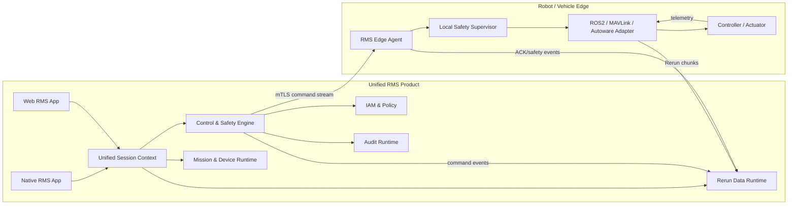
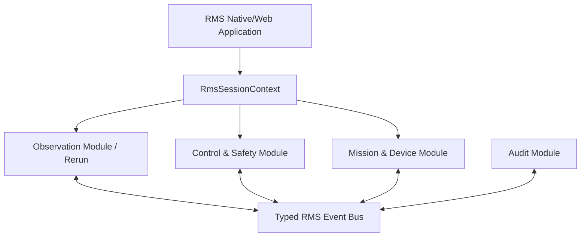
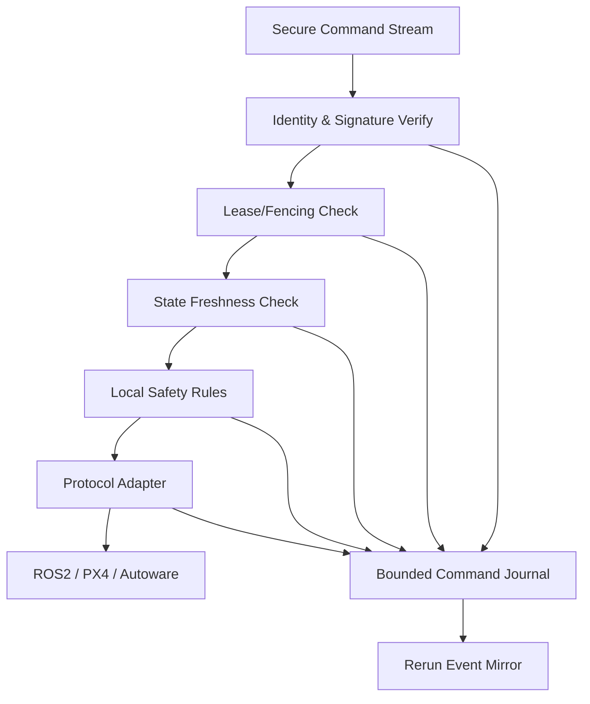
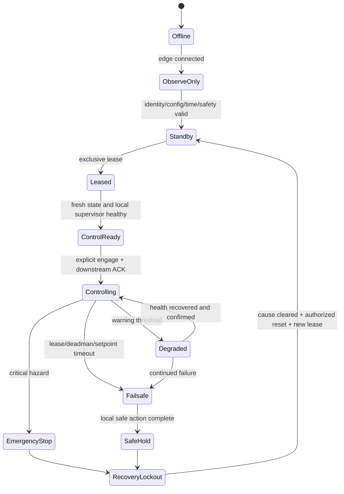
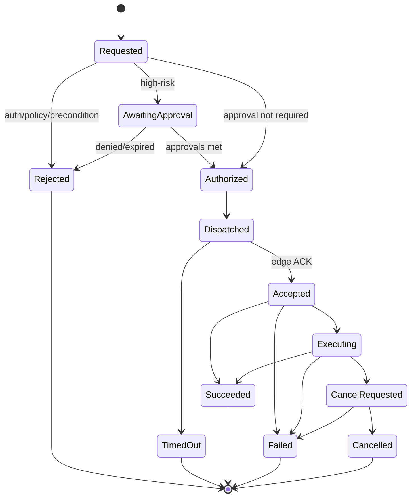

# RMS 상세 시스템 설계

> 상태: Draft v0.1
> 기준 코드: Rerun `0.36.1` (`7d547c837e33484fdd9c8ad7a7acea7a2c6707b7`)
> 조사 기준일: 2026-08-19
> 대상: 로봇, 드론, 자율주행 장비의 실시간 관제, Recording, Replay, 원격 제어

## 1. 결론

RMS는 Rerun을 데이터 모델, Chunk Store, Query, Transform, Viewer, Renderer의 기반으로 사용하고, Mission·Device·사용자·제어·안전·감사를 동일 제품 Runtime 안에 통합한다. 운영자는 하나의 RMS 앱, 하나의 로그인, 하나의 Mission/Session, 하나의 Viewer에서 Live·Replay·분석·제어를 모두 수행한다.

다만 통합을 “모든 코드를 한 process와 한 message channel에 넣는 것”으로 정의하지 않는다. 물리 장비를 움직이는 실행 경로는 통합 RMS 내부의 격리된 안전 모듈과 Edge Agent를 통과한다. 이 경계는 별도 제품이 아니라 하나의 제품을 안전하게 만드는 내부 구조다.

최종 구조는 다음 원칙을 따른다.

1. **RMS는 하나의 통합 제품이다.** Viewer, Mission, Live/Replay, Control, Safety, Audit가 하나의 App Runtime과 Session Context를 공유한다.
2. **Rerun은 통합 제품의 Data Runtime이다.** 센서, 상태, 진단, 명령 결과를 기록하고 조회하고 시각화한다.
3. **Control Engine은 RMS 내부 모듈이다.** 인증, 권한, 제어권 임대, 안전 검증, 명령 전달, ACK 추적을 담당한다.
4. **Edge가 최종 안전 권한을 가진다.** Cloud나 Viewer가 허용해도 Edge Safety Agent가 현재 상태에서 위험한 명령을 거부할 수 있다.
5. **Replay는 절대로 Actuator를 구동하지 않는다.** Replay 중 생성되는 UI 이벤트와 과거 Command Entity는 제어 실행 모듈로 전달되지 않는다.
6. **모든 제어 사건은 같은 Rerun Session에 기록한다.** 요청, 승인, 거부, 전달, ACK, 완료, 안전 개입을 Timeline에서 센서 데이터와 함께 조회한다.
7. **Rerun upstream 변경은 제한한다.** 제품 소유 Facade, Registry, Panel, Visualizer를 통해 확장하고 upstream patch를 작은 단위로 관리한다.



### 1.1 통합의 사용자 경험

운영자에게 다음은 모두 하나의 화면과 하나의 Session으로 제공한다.

- Fleet/Robot/Drone/Vehicle 선택
- Mission과 Recording 선택
- Live/Pause/Seek/Replay/Return-to-live
- 3D/Map/Camera/Plot/State Timeline
- 제어권 획득과 mode 전환
- Navigation/Takeoff/Land/Mission command
- Command 진행률, ACK, 안전 개입
- Incident 생성과 과거 원인 분석

내부 module 분리는 사용자가 별도 서비스를 열거나 별도 계정으로 로그인해야 한다는 의미가 아니다.

## 2. 범위와 비범위

### 2.1 포함 범위

- ROS 2 로봇, PX4/MAVLink 드론, Autoware 차량
- Native 및 Web Viewer
- Live, Pause, 과거 탐색, Replay, Return-to-live
- Mission/Session/Recording 관리
- 저위험 장비 제어, 임무 제어, 고위험 동작 승인
- Command 상태 추적과 감사
- 다중 장비 관제
- 연결 단절, 지연, 데이터 유실, Edge 재시작 대응
- SIL/HIL 기반 안전 검증

### 2.2 비범위

- Cloud나 Browser가 모터 제어 루프를 직접 수행하는 구조
- RRD를 실행 가능한 명령 스크립트로 사용하는 기능
- 안전 PLC, 비상 정지 회로, Flight Controller 자체 Failsafe의 대체
- 초기 단계의 RRD 포맷 또는 Redap 프로토콜 비호환 변경
- 모든 규제 도메인에 대한 즉시 인증 획득

## 3. 조사 근거

### 3.1 Rerun 공식 자료에서 확인된 사실

- Rerun의 데이터는 Entity와 Component로 모델링되며 핵심 Query는 `latest-at`과 `range`이다. 부분 갱신이 가능하다.
  출처: [Query semantics & partial updates](https://rerun.io/docs/concepts/logging-and-ingestion/latest-at)
- 모든 데이터는 Arrow 기반 Chunk로 저장된다.
  출처: [Chunks](https://rerun.io/docs/concepts/logging-and-ingestion/chunks)
- RRD는 `LogMsg`의 선형 스트림이며 선택적 Footer Manifest로 random access를 지원한다.
  출처: [RRD format](https://rerun.io/docs/concepts/logging-and-ingestion/rrd-format)
- RRD 전용 문서는 `0.23+` 형식의 load-time migration을 설명하지만 일부 Getting Started와 Architecture 문구에는 더 좁은 호환 범위가 남아 있다. 문서 표현이 일치하지 않으므로 실제 fixture 기반 호환성 CI를 계약으로 삼는다.
  출처: [RRD format](https://rerun.io/docs/concepts/logging-and-ingestion/rrd-format), [Data input](https://rerun.io/docs/getting-started/data-in), [Rerun Architecture](https://github.com/rerun-io/rerun/blob/0.36.1/ARCHITECTURE.md)
- Blueprint는 Recording과 같은 ECS 구조의 데이터이며 Viewer는 매 frame Recording과 Blueprint를 Query해 결정론적으로 렌더링한다.
  출처: [Blueprints](https://rerun.io/docs/concepts/visualization/blueprints)
- Viewer 확장은 Rust에서 Panel, built-in View용 Visualizer, Custom View 방식으로 가능하지만 인터페이스는 아직 안정적이지 않고 release마다 깨질 수 있다.
  출처: [Implement custom visualizations](https://rerun.io/docs/howto/visualization/extend-ui)
- Web Viewer는 32-bit Wasm 메모리 제약으로 실사용 메모리가 약 2 GiB 수준이며 Native보다 제약이 크다.
  출처: [How does Rerun work?](https://rerun.io/docs/concepts/how-does-rerun-work)
- 기본 Viewer는 데이터를 RAM에 올리며 memory limit 도달 시 오래된 데이터를 제거한다.
  출처: [Limit the viewer's memory usage](https://rerun.io/docs/howto/visualization/limit-ram)
- OSS Catalog는 현대 RRD의 Footer Manifest를 이용한 on-demand Chunk read를 지원하지만 metadata/runtime는 단일 노드·개발용 성격이며, Footer 없는 legacy RRD는 eager loading 경로가 필요하다.
  출처: [Rerun 0.32 release](https://github.com/rerun-io/rerun/releases/tag/0.32.0), [Query and transform overview](https://rerun.io/docs/howto/query-and-transform/overview)
- 현재 CLI의 server는 인메모리 서버로 설명되며 gRPC proxy는 late viewer를 위해 history를 buffer하다 한도를 넘으면 오래된 메시지를 제거한다.
  출처: [Rerun CLI manual](https://rerun.io/docs/reference/cli)
- Auth/SSO, 관리형 persistent catalog, 큰 규모의 운영 격리는 상용 Hub와 RMS 제품 계층의 책임으로 보아야 한다. OSS server를 인터넷에 그대로 노출하지 않는다.
  출처: [Rerun OSS and Hub comparison](https://rerun.io/pricing)
- Viewer MCP는 Viewer 상태 조회, 화면 조작, URL 열기와 Timeline 이동을 지원하지만 장비 제어 프로토콜은 아니다.
  출처: [Rerun Viewer MCP](https://rerun.io/docs/reference/viewer/mcp)
- 저장소는 MIT 또는 Apache-2.0 dual license를 사용한다. 제품 배포 시 저작권 고지와 선택한 license 의무를 유지한다.
  출처: [Rerun repository](https://github.com/rerun-io/rerun), [LICENSE-MIT](https://github.com/rerun-io/rerun/blob/main/LICENSE-MIT)

### 3.2 제어 도메인 공식 자료에서 확인된 사실

- ROS 2 Topic은 연속 데이터, Service는 짧은 요청/응답, Action은 feedback과 cancel/preemption이 필요한 장시간 동작에 적합하다.
  출처: [ROS 2 Interfaces](https://docs.ros.org/en/ros2_documentation/rolling/Concepts/Basic/Interfaces-Topics-Services-Actions.html)
- ROS 2 QoS는 reliability, durability, deadline, lifespan, liveliness, lease duration을 제공한다. Service는 오래된 요청 재전달을 피하기 위해 volatile durability가 중요하다.
  출처: [ROS 2 QoS](https://docs.ros.org/en/humble/Concepts/Intermediate/About-Quality-of-Service-Settings.html)
- SROS 2/DDS Security는 PKI 인증, 접근 제어, AES-GCM 기반 authenticated encryption을 제공하지만 기본 활성화 상태는 아니다.
  출처: [ROS 2 DDS-Security integration](https://design.ros2.org/articles/ros2_dds_security.html)
- MAVLink Command Protocol은 `COMMAND_INT/LONG`, `COMMAND_ACK`, 재시도, 진행 상태, 취소를 정의한다. `ACCEPTED`는 완료가 아니라 실행 시도를 수락했다는 의미일 수 있다.
  출처: [MAVLink Command Protocol](https://mavlink.io/en/services/command.html)
- MAVLink 2 signing은 송신자 인증을 제공하지만 암호화는 제공하지 않는다.
  출처: [MAVLink FAQ](https://mavlink.io/en/about/faq.html), [Message Signing](https://mavlink.io/en/guide/message_signing.html)
- PX4 Offboard는 지속적인 proof-of-life stream을 요구하고 stream 상실 시 Offboard mode를 이탈한다. PX4는 data-link loss, offboard loss, geofence 등 별도 Failsafe를 제공한다.
  출처: [PX4 Offboard Mode](https://docs.px4.io/main/en/flight_modes/offboard.html), [PX4 Safety Configuration](https://docs.px4.io/main/en/config/safety)
- Autoware AD API는 외부 FMS/HMI에서 차량을 운용하기 위한 안정 인터페이스를 목표로 하지만 보안은 비범위라고 명시한다. RMS가 보안을 감싸야 한다.
  출처: [Autoware interface design](https://autowarefoundation.github.io/autoware-documentation/1.8.0/design/autoware-architecture-v1/interfaces/)
- Autoware는 Stop, Autonomous, Local, Remote operation mode를 구분하고 mode 전환 가능 여부와 전환 상태를 노출한다.
  출처: [Autoware Operation mode](https://autowarefoundation.github.io/autoware-documentation/main/design/autoware-architecture-v1/interfaces/ad-api/features/operation_mode/)
- `vehicle_cmd_gate`는 autonomous, external, emergency command source를 선택하고 heartbeat timeout 및 command limit을 제공한다. RMS는 이 gate를 우회하지 않는다.
  출처: [Autoware vehicle_cmd_gate](https://autowarefoundation.github.io/autoware_universe/main/control/autoware_vehicle_cmd_gate/)
- NIST Zero Trust는 네트워크 위치만으로 신뢰하지 않고 사용자와 장비를 각각 인증·인가하며 Policy Engine과 Policy Enforcement Point를 둔다.
  출처: [NIST SP 800-207](https://csrc.nist.gov/pubs/sp/800/207/final)

## 4. 현재 Rerun의 문제점과 RMS 개선 방향

| 번호 | 현재 상태/문제 | 제품 위험 | RMS 개선 |
|---|---|---|---|
| R1 | Viewer extension API가 불안정 | 매 upstream upgrade마다 도메인 UI 파손 | 제품 소유 `RmsViewerExtensionRegistry`와 adapter facade 고정 |
| R2 | Web Viewer가 약 2 GiB Wasm 메모리 제약 | 대형 LiDAR/다중 카메라 Replay 실패 | Native 우선, Web LOD/thumbnail/on-demand fetch, session budget |
| R3 | Live `LogMsg`와 Redap/RRD Manifest fetch 경로가 분리 | 정책과 오류 처리 중복, 일관성 저하 | `RmsObservationIngress` 공통 envelope와 metric 계층 |
| R4 | Viewer 데이터는 기본적으로 RAM 중심 | 장시간 Live/대규모 Recording에서 GC로 문맥 손실 | RRD footer/index, object store, provider cache, cursor-aware prefetch |
| R5 | GC 후 arbitrary latest-at 결과가 달라질 수 있음 | 정적 상태/Transform 문맥 손실 | semantic pinning, checkpoint, protected component policy |
| R6 | Transform history Prefetch가 문자열 접두사에 의존 | custom transform component 누락 | 등록형 `HistoryCriticalComponent` policy |
| R7 | `LazyStore`는 cache-free | 이를 Viewer cache로 오해하면 설계 불일치 | Server provider cache와 Viewer prefetch cache 분리 |
| R8 | gRPC proxy는 메모리 초과 시 오래된 history 제거 | late joiner가 불완전한 Live 상태 수신 | durable recording 동시 저장, checkpoint + gap marker |
| R9 | `re_server`는 제품용 HA/권한 서버가 아님 | 인증, tenancy, 보존, 장애 복구 부족 | 통합 `rms-server` 내부 Gateway/Catalog/Auth module로 보완 |
| R10 | RRD는 새 serializer/compression을 모르면 거부 | SDK/Viewer 호환성 손실 | 표준 RRD+LZ4 유지, 호환성 matrix CI |
| R11 | Viewer 내부 Command는 UI 상태 변경용 | 장비 제어에 필요한 권한/ACK/안전 없음 | 별도 typed Control API와 Edge Agent |
| R12 | Blueprint가 Application ID에 결합 | 조직별 preset 충돌/오염 | immutable preset + user overlay + policy-controlled publication |
| R13 | Missing Chunk 정보가 충분히 구조화되지 않음 | 유실 원인과 영향 분석이 어려움 | chunk ID, source, reason, affected query를 telemetry로 기록 |
| R14 | GPU/Video cache에 통합 예산 정책이 약함 | 다중 카메라에서 VRAM 폭증/decoder churn | view visibility 기반 decode 및 GPU residency budget |
| R15 | Viewer MCP가 UI를 조작할 수 있음 | 운영 환경에서 agent 권한이 제어 권한으로 오인될 수 있음 | MCP와 Device Control 자격증명/포트/프로세스 완전 분리 |
| R16 | 공식 RRD 호환성 설명이 문서 위치에 따라 다름 | upgrade 후 과거 Recording 해석 오류 | SDK/Viewer/RRD fixture를 실제 제품 호환 계약으로 운영 |
| R17 | Native ROS 2 bridge가 제품 수준으로 내장되어 있지 않음 | topic/QoS/TF/custom message 지원 공백 | RMS ROS 2 live adapter와 지원 메시지 matrix 운영 |
| R18 | OSS와 Hub의 인증·운영 범위가 다름 | OSS endpoint를 production multi-tenant server로 오인 | RMS OIDC, ACL, quota, HA metadata를 별도 구축 |

### 4.1 로컬 코드 근거

- Prefetch 예산과 stage: `crates/store/re_entity_db/src/rrd_manifest_index/chunk_prioritizer.rs`
- Active/Preview/Inactive Recording별 Prefetch: `crates/viewer/re_viewer/src/prefetch_chunks.rs`
- Recording별 `EntityDb`, `ChunkStore`, `QueryCache`: `crates/store/re_entity_db/src/entity_db.rs`
- GC와 보호 Chunk: `crates/store/re_chunk_store/src/gc.rs`
- Cache-free LazyStore: `crates/store/re_chunk_store/src/lazy_store.rs`
- Viewer 내부 Command bus: `crates/viewer/re_viewer_context/src/command_sender.rs`
- Viewer MCP UI command: `crates/store/re_log_channel/src/data_source_message.rs`
- gRPC proxy history GC와 loopback service: `crates/store/re_grpc_server/src/lib.rs`
- RRD compression/version 처리: `crates/store/re_log_encoding/src/rrd/frames.rs`
- Viewer TimeControl: `crates/viewer/re_viewer_context/src/time_control/mod.rs`
- View/Visualizer registry: `crates/viewer/re_viewer_context/src/view/view_class_registry.rs`

### 4.2 코드 감사에서 확인된 구체적 제약

| 영역 | 코드 사실 | 설계 반영 |
|---|---|---|
| Batching | 기본 flush 약 200 ms, 2 MiB, 100 MiB in-flight이며 low-latency preset은 8 ms tick이다. `crates/store/re_chunk/src/batcher.rs:129` | Sensor class별 latency/byte policy를 `rms_ingress`에서 적용 |
| Backpressure | Native quota channel은 producer를 block하지만 Wasm은 용량 초과 후에도 전송한다. `crates/utils/re_quota_channel/src/sync/mod.rs:126`, `:215` | Web hard budget, admission, drop accounting 별도 구현 |
| Live channel | Viewer log channel의 on-wire budget이 128 MiB로 고정되어 있다. `crates/store/re_log_channel/src/lib.rs:269` | Safety/Control state를 video/bulk와 다른 lane으로 분리 |
| Proxy GC | legacy gRPC proxy는 memory limit 초과 시 오래된 message를 제거한다. `crates/store/re_grpc_server/src/lib.rs:876` | durable RRD, checkpoint, gap event 필수 |
| OSS auth | local `WhoAmI`가 인증 없이 full access를 반환하며 permission도 Read/ReadWrite 중심이다. `crates/store/re_server/src/rerun_cloud/mod.rs:585`, `crates/utils/re_auth/src/lib.rs:23` | RMS resource-scoped OIDC/RBAC/ABAC 구축 |
| Query completeness | Query result는 missing Chunk ID를 알 수 있지만 Viewer reporter는 boolean 중심이다. `crates/store/re_query/src/latest_at.rs:235`, `crates/store/re_chunk_store/src/missing_chunk_reporter.rs:3` | Complete/Partial/Stale/Unavailable 품질 모델 추가 |
| Partial latest-at | 필요한 Chunk가 빠지면 확보된 physical 결과도 최종 current value로 사용하지 않는다. `crates/store/re_query/src/latest_at.rs:736` | Spinner만 표시하지 않고 control eligibility에서 제외 |
| GC | candidate 전체 정렬/수집 구간이 time budget을 지키지 못할 수 있다. `crates/store/re_chunk_store/src/gc.rs:381` | paged/interruptible candidate scan |
| Time event | 일부 ad-hoc seek는 Blueprint를 갱신하지 않고 cursor callback에는 throttle TODO가 있다. `crates/viewer/re_viewer_context/src/time_control/mod.rs:416`, `:594` | 안정적인 `RmsRuntimeEvent` facade와 coalescing |
| Blueprint | Native는 `.rbl` 저장을 지원하지만 Web persistence는 no-op 경로가 있다. `crates/viewer/re_viewer/src/app/mod.rs:1727` | 서버 기반 preset/overlay 저장소 |
| Video/GPU | 직전 frame 미사용 decoder/texture 제거로 camera 전환 churn 가능성이 있다. `crates/viewer/re_renderer/src/video/mod.rs:287`, `texture_manager.rs:170` | warm-set TTL과 통합 residency policy |
| Web | direct file load, mobile, browser backend, single-worker decode에 별도 제약이 있다. `crates/viewer/re_viewer/src/app/add_data_source.rs:118`, `crates/viewer/re_web_viewer_server/web_viewer/index.html:232` | Client capability negotiation과 Web degraded profile |

Control Panel은 단순 loading spinner 대신 내부적으로 다음 품질 상태를 받아야 한다.

```text
Complete
Partial { missing_chunk_ids, cause, retryable }
Stale { age, source_health, clock_quality }
Unavailable { cause }
```

Operator 화면에는 이를 `정상`, `데이터 지연`, `일부 데이터 없음`, `사용할 수 없음`으로 단순화해 표시하고, `Partial/Stale/Unavailable`인 필수 상태로 위험 명령을 실행하지 않는다.

## 5. 통합 논리 아키텍처

RMS는 하나의 `RmsIntegratedRuntime`으로 조립한다. 내부적으로 네 개 Plane을 구분하지만 사용자·API client·Viewer에는 하나의 제품으로 제공한다.



`RmsSessionContext`가 다음 식별자와 상태를 한 곳에서 결합한다.

```text
organization / project
mission / operation
device / edge_session
recording / segment / layer
viewer route / timeline / selection
live head / replay state
operator identity / role
control lease / safety state
active command / incident
```

Rerun `TimeControl`은 시각화 시간의 Source of Truth로 유지한다. 통합 Runtime은 이를 `Live`, `PausedLive`, `Replay`로 해석하여 같은 Session의 `ControlEligibility`를 계산한다. 따라서 별도 앱을 오가는 대신 한 화면에서 상태가 전환되지만 Replay 격리 규칙은 유지된다.

### 5.1 Observation Plane

책임:

- 센서/상태/진단 수집
- source timestamp 보존과 normalized timestamp 추가
- Rerun Archetype/Component 변환
- Live stream과 RRD 동시 기록
- Query, Replay, derived data layer
- Gap, drop, clock skew, decode latency 관측

Observation Plane 장애는 제어 명령의 안전 검증에 영향을 줄 수 있으므로 Control Plane은 telemetry freshness를 직접 검사하지만, Observation Plane 메시지 자체가 명령을 발생시키지는 않는다.

### 5.2 Control Plane

책임:

- 사용자/서비스 인증
- RBAC+ABAC 정책 평가
- 장비별 단일 제어권 Lease
- typed command validation
- 상태 version과 precondition 검사
- 승인, dispatch, ACK, timeout, cancel
- Emergency 경로 우선순위
- Edge와의 bidirectional command stream

### 5.3 Management Plane

책임:

- 조직, 프로젝트, 사용자, 역할
- Device Registry와 인증서 수명주기
- Mission, Operation, Session
- Recording Catalog, retention, legal hold
- Preset/Blueprint 배포
- 소프트웨어/설정 버전

### 5.4 Audit Plane

책임:

- 모든 권한 결정과 명령 상태 전이의 append-only 저장
- Rerun control layer로 시각화 가능한 사본 생성
- 원본 감사 Event의 WORM 보존
- hash chain 또는 서명 checkpoint
- 사용자, 서비스, 장비 identity와 trace 연결

## 6. 통합 Runtime과 논리 모듈 설계

아래 항목은 제품 내부의 논리적 책임이다. 초기 배포에서 각각을 독립 제품이나 별도 사용자 UI로 만들지 않는다.

| 서비스 | 책임 | 상태 저장 | Rerun 의존 |
|---|---|---|---|
| `rms-api-gateway` | Web/Native API, rate limit, OIDC | 없음 | 없음 |
| `rms-control-gateway` | Lease, policy, command lifecycle | Command DB | Audit mapper만 |
| `rms-policy-engine` | RBAC/ABAC, step-up/dual approval | Policy DB | 없음 |
| `rms-device-registry` | 장비 identity/certificate/capability | Registry DB | 없음 |
| `rms-edge-agent` | Edge session, adapter, local safety | bounded journal | Rerun SDK sink |
| `rms-observation-ingress` | protocol mapping, batching, QoS | bounded buffer | `re_chunk`, SDK |
| `rms-recording-service` | RRD finalize/index/object storage | Object store | encoding/store |
| `rms-query-gateway` | Live/Replay query routing | cache | Redap/query |
| `rms-mission-service` | Mission/Operation/Session catalog | Metadata DB | URI/recording IDs |
| `rms-audit-service` | immutable audit, search, export | WORM + index | Rerun mirror |
| `rms-viewer-native/web` | visualization and operator UI | local UI state | Viewer/Renderer |

### 6.1 초기 배포 단위

과도한 서비스 분산을 피하기 위해 첫 제품은 다음 세 배포 단위로 시작한다.

| 배포 단위 | 포함 모듈 | 이유 |
|---|---|---|
| `rms-app-native` / `rms-app-web` | 통합 Viewer, Mission, Control, Incident UI | 사용자에게 하나의 앱 제공 |
| `rms-server` | API/BFF, Mission, Device, Control, Policy, Query, Recording, Audit | modular monolith로 transaction과 운영 단순화 |
| `rms-edge-agent` | Edge session, local safety, protocol adapter, spool | 장비 가까이에서 독립 Failsafe 수행 |

규모가 커지면 `rms-server` 내부 모듈을 동일 API 계약을 유지한 채 분리할 수 있다. 서비스 분리는 배포 최적화이며 제품 분리가 아니다.

### 6.2 단일 제품 API

Native와 Web은 하나의 RMS origin과 인증 Session을 사용한다.

```text
/api/session       현재 통합 Session
/api/fleet         장비와 health
/api/missions      Mission/Operation
/api/recordings    Live/Replay/Catalog
/api/control       Lease/Command/ACK
/api/incidents     Alert/Incident
/api/audit         권한 있는 감사 조회
/rerun             Chunk/Manifest/Viewer data gateway
```

UI가 여러 backend module의 상태를 직접 조합하지 않도록 BFF가 `RmsSessionSnapshot`과 typed event stream을 제공한다.

## 7. Edge Agent 설계

Edge Agent는 Cloud와 실제 Controller 사이의 Policy Enforcement Point이다.



### 7.1 필수 기능

- 장비별 mTLS identity
- 짧은 수명의 command session
- 단조 증가 fencing token 검증
- `command_id` deduplication
- `expires_at`, `not_before`, clock skew 검증
- 최근 장비 상태와 mode 확인
- local geofence/speed/acceleration/workspace limit
- Cloud 단절 시 설정된 safe action 수행
- 재부팅 후 미완료 명령을 자동 재실행하지 않음
- ACK journal을 연결 복구 후 재전송
- Observation queue가 가득 차도 Emergency ACK lane은 유지

### 7.2 제어권 Lease

한 장비 또는 subsystem에는 동시에 하나의 유효한 interactive controller만 허용한다.

```text
Lease {
  lease_id: UUIDv7
  resource: org/project/device/subsystem
  holder_subject: user-or-service-id
  issued_at, expires_at
  fencing_token: monotonically increasing u64
  capabilities: [navigate, teleop, arm, land, ...]
  max_command_rate
  approval_policy
}
```

- TTL 기본값은 명령 유형별로 설정한다.
- Client는 TTL의 1/3 주기로 renew한다.
- 새 Lease가 발행되면 fencing token이 증가한다.
- Edge는 이전 token의 명령을 연결 상태와 관계없이 거부한다.
- Local operator/physical safety controller가 Cloud Lease를 선점할 수 있다.
- Emergency stop은 일반 Lease와 별도의 정책을 사용하지만 인증과 감사는 생략하지 않는다.

### 7.3 Heartbeat와 Deadman 분리

다음 신호를 하나의 `connected` boolean으로 합치지 않는다.

| 신호 | 의미 | 상실 시 동작 |
|---|---|---|
| Transport heartbeat | Viewer-Gateway-Edge 연결 생존 | reconnect 또는 Lease 만료 시작 |
| Operator ready/deadman | 사람이 계속 제어할 의지와 능력이 있음 | interactive input neutral, safe hold |
| Setpoint watchdog | 신선한 setpoint가 설정 주기로 생성됨 | controller-native failsafe |
| Vehicle feedback | 실제 mode/state가 명령을 반영함 | command 실패 또는 degraded/failsafe |

PX4 proof-of-life가 살아 있다고 해서 원격 운영자가 영상을 보고 있거나 deadman을 누르고 있다는 의미는 아니다. Browser focus 상실, gamepad 분리, deadman 해제, 영상 freshness 초과를 별도로 감지한다. Heartbeat가 복구되어도 자동으로 재운행하지 않고 새 Lease와 명시적 engage를 요구한다.

### 7.4 운용 안전 상태기계

ROS Lifecycle은 Adapter process의 기술적 준비 상태에 사용하고 실제 장비 운용 권한에는 다음 별도 상태기계를 사용한다.



Emergency 해제 권한은 Emergency 실행 권한보다 더 제한한다. 복구 시 이전 setpoint, 미완료 command, 이전 Lease를 재사용하지 않는다.

## 8. 명령 모델

### 8.1 Command Envelope

`google.protobuf.Any`에 임의 payload를 넣는 방식보다 versioned `oneof` typed command를 사용한다.

```protobuf
message CommandEnvelope {
  string command_id = 1;          // UUIDv7, idempotency key
  string trace_id = 2;
  string organization_id = 3;
  string project_id = 4;
  string mission_id = 5;
  string device_id = 6;
  string subsystem = 7;
  string lease_id = 8;
  uint64 fencing_token = 9;
  string issued_by = 10;
  int64 issued_at_ns = 11;
  int64 not_before_ns = 12;
  int64 expires_at_ns = 13;
  uint64 expected_state_version = 14;
  bool dry_run = 15;
  uint32 schema_version = 16;
  uint64 lease_sequence = 17;
  bytes payload_hash = 18;

  oneof command {
    NavigateTo navigate_to = 30;
    SetVelocityLimit set_velocity_limit = 31;
    PauseMission pause_mission = 32;
    ResumeMission resume_mission = 33;
    DroneArm drone_arm = 34;
    DroneTakeoff drone_takeoff = 35;
    DroneLand drone_land = 36;
    ReturnToHome return_to_home = 37;
    CameraPtz camera_ptz = 38;
    EmergencyStop emergency_stop = 39;
  }
}
```

### 8.2 Command 상태기계



규칙:

- 동일한 `command_id`는 동일한 최종 결과를 반환하고 두 번 실행하지 않는다.
- `Accepted`와 `Succeeded`를 구분한다.
- timeout 후 무조건 retry하지 않는다. 명령별 retry policy와 장비 상태 재조회가 필요하다.
- non-idempotent command의 통신 불명 상태는 `OutcomeUnknown`으로 표시하고 운영자 확인 없이 재전송하지 않는다.
- 같은 `command_id`에 다른 payload hash가 오면 보안 오류로 거부한다.
- Lease 내부 sequence가 뒤로 가거나 이미 처리된 값이면 거부한다.
- 모든 상태 전이는 actor, reason code, monotonic timestamp와 함께 저장한다.

### 8.3 위험 등급

| 등급 | 예 | 기본 정책 |
|---|---|---|
| L0 관측 | 카메라 선택, Blueprint 변경 | 제어 Lease 불필요 |
| L1 저위험 | PTZ, 조명, data capture | 단일 권한, rate limit |
| L2 운용 | Mission pause/resume, navigation goal | Lease + 상태 precondition + 확인 |
| L3 고위험 | arm, takeoff, mode change, remote drive | step-up 인증 + dual approval 또는 현장 승인 |
| L4 비상 | emergency stop, RTL/controlled stop | 독립 우선 lane, 명확한 복구 절차 |

Flight termination이나 motor kill처럼 동작 자체가 더 큰 위험을 만들 수 있는 명령은 일반적인 “안전 버튼”과 구분하고 기본 UI에 노출하지 않는다.

## 9. Live와 Replay 안전 분리

Viewer의 Timeline cursor는 장비 제어 시간의 Source of Truth가 아니다.

### 9.1 제어 활성화 조건

다음 조건이 모두 참일 때만 제어 UI를 활성화한다.

1. Route가 `LiveSession(device_id, edge_session_id)`이다.
2. 사용자가 명시적으로 Live Head에 복귀했다.
3. 최근 telemetry age가 command별 임계값보다 작다.
4. Edge session heartbeat가 정상이다.
5. 유효한 Lease와 fencing token이 있다.
6. 장비 mode와 safety state가 명령 precondition을 만족한다.
7. Viewer가 표시하는 Transform/Map version과 Edge가 검증할 version이 일치한다.

### 9.2 불변조건

```text
Invariant 1: Replay/Paused/PastCursor -> CommandDispatch = 0
Invariant 2: RRD/Blueprint/EntityDb data -> direct actuator invocation = 0
Invariant 3: Viewer process crash -> actuator continues remote command = 0
Invariant 4: Expired lease/fencing token -> Edge execute = 0
Invariant 5: Stale state -> hazardous command execute = 0
```

Replay 중에는 “명령 재현” 대신 다음 기능만 제공한다.

- 과거 명령과 승인 과정 시각화
- 명령 결과와 궤적 비교
- `dry_run` simulation request 생성
- 새 Mission 초안 생성
- 운영자 승인 후 별도 Live 화면에서 새 command 생성

## 10. 도메인 Adapter

### 10.1 ROS 2

| 동작 | ROS 2 인터페이스 | RMS 처리 |
|---|---|---|
| 센서/상태 | Topic | source QoS 보존, Rerun Chunk 변환 |
| 짧은 상태 변경 | Service | idempotency/precondition wrapper |
| Navigation/작업 | Action | goal-feedback-result-cancel 매핑 |
| 고주파 teleop | Topic | Edge가 rate/deadman/limit 적용 |
| node lifecycle | Lifecycle Service | 허용 transition whitelist |

권장:

- Sensor는 source QoS를 감지하고 best-effort/reliable을 무조건 변환하지 않는다.
- 제어 Service는 volatile durability를 유지하고 오래된 request가 재실행되지 않게 한다.
- 장시간 동작은 Action으로 매핑해 feedback/cancel을 보존한다.
- SROS 2 strict mode, Edge Adapter 전용 enclave, topic/service/action allowlist를 사용한다.
- 일반 Operator는 raw topic publish 권한을 갖지 않는다.
- Viewer, telemetry bridge, control adapter, safety supervisor를 별도 process와 SROS 2 enclave로 격리한다. 같은 DDS context에 composition하여 권한 합집합을 만들지 않는다.
- `ROS_SECURITY_ENABLE=true`, strict/enforce 전략과 명시적 topic/service/action allowlist를 제품 baseline으로 둔다.
- 공식 Rerun ROS 2 예제는 ROS node가 topic을 구독하여 Archetype으로 변환하는 방식이므로 RMS가 live bridge, TF/TF_STATIC, custom message schema와 지원 배포판을 소유한다.
  출처: [Use Rerun with ROS 2](https://rerun.io/docs/howto/integrations/ros2-nav-turtlebot)

### 10.2 MAVLink/PX4

- 위치 명령은 지원 가능하면 frame과 정밀도가 명확한 `COMMAND_INT`를 사용한다.
- `COMMAND_ACK`의 accepted/in-progress/final result를 RMS 상태기계에 매핑한다.
- ACK timeout 재시도는 MAVLink 규칙과 command idempotency를 함께 고려한다.
- MAVLink 2 signing을 활성화한다.
- signing은 암호화가 아니므로 원격 구간은 mTLS/VPN tunnel 내부에 둔다.
- unsigned command와 broadcast `target_system/target_component` command는 기본 거부한다.
- signing setup key와 private key를 RRD, 일반 telemetry, audit payload에 기록하지 않는다.
- Browser가 Offboard setpoint를 직접 stream하지 않는다. Edge가 PX4 proof-of-life를 생성하며 Cloud는 목표 intent와 제한만 전달한다.
- PX4 data-link/offboard-loss/geofence/battery failsafe를 필수 baseline으로 검사한다.
- RMS Emergency와 PX4 flight termination을 같은 명령으로 취급하지 않는다.

### 10.3 Autoware

- RMS는 AD API 및 `vehicle_cmd_gate` 앞에서 동작하고 gate를 우회하지 않는다.
- Operation mode 전환 전 `change_to_*` flag, 속도, gear, localization, route, hazard state를 확인한다.
- Remote mode heartbeat를 Edge가 생성하며 Cloud 지연이 actuator 주기를 결정하지 않게 한다.
- 외부 command timeout과 emergency heartbeat timeout을 차량별 safety profile로 관리한다.
- transport heartbeat와 원격 운전자의 `ready` heartbeat를 분리하고, operator ready가 false 또는 timeout이면 MRM으로 연결한다.
- `is_in_transition` 동안 운영자에게 책임 상태를 명확하게 보여 주고 다음 mode command를 제한한다.
- Autoware AD API가 보안을 제공한다고 가정하지 않고 RMS mTLS/IAM/SROS 2가 감싼다.

### 10.4 Camera/Media

```text
Camera --RTSP/RTP--> Edge Media Gateway --WebRTC/SFU--> Operator Web/Native
                  \--recording/metadata--> Observation Ingress
```

- RTSP는 현장 camera ingest와 저장 영상 접근에 사용하고 장비 명령에는 사용하지 않는다.
- Browser 실시간 영상은 WebRTC를 기본 후보로 삼는다.
- packet loss, jitter, frame drop, decode delay, last capture age를 측정한다.
- transport 연결이 살아 있어도 freeze된 영상을 탐지한다.
- 영상 freshness는 control eligibility의 입력이지만 사용자 권한이나 Lease를 대체하지 않는다.
- WebRTC DataChannel 기반 joystick을 채택할 경우 media와 별도 logical channel, 짧은 packet lifetime, sequence/TTL/fencing token, Edge deadman을 적용한다.

출처: [WebRTC](https://www.w3.org/TR/webrtc/), [WebRTC Security Architecture](https://www.rfc-editor.org/rfc/rfc8827.html), [WebRTC Statistics](https://www.w3.org/TR/webrtc-stats/), [RTSP 2.0](https://www.rfc-editor.org/rfc/rfc7826.html)

## 11. Rerun 데이터 모델

### 11.1 Entity 경로

```text
/fleet/{device_id}/state
/fleet/{device_id}/frames/{frame_id}
/fleet/{device_id}/sensors/{sensor_id}
/fleet/{device_id}/perception/objects
/fleet/{device_id}/planning/trajectory
/fleet/{device_id}/safety/zones
/fleet/{device_id}/diagnostics/{component}
/missions/{mission_id}/route
/missions/{mission_id}/events
/control/{device_id}/authority
/control/{device_id}/commands/{command_id}
/control/{device_id}/acks/{command_id}
/control/{device_id}/safety_events/{event_id}
```

### 11.2 Timeline

원본 시간을 덮어쓰지 않고 여러 Timeline을 유지한다.

| Timeline | 의미 |
|---|---|
| `sensor_time` | 센서/Controller가 생성한 시간 |
| `receive_time` | Edge가 수신한 시간 |
| `ingest_time` | RMS Ingress가 Chunk로 변환한 시간 |
| `mission_time` | Mission 상대 시간 |
| `frame_index` | source frame sequence |
| `control_time` | Control Gateway의 명령 상태 전이 시간 |

동기화 품질을 별도 Component로 저장한다.

```text
ClockQuality {
  source_clock,
  offset_ns,
  uncertainty_ns,
  sync_method,
  last_sync_time,
  discontinuity_count
}
```

### 11.3 RMS Custom Component

- `rms.components.DeviceState`
- `rms.components.ConnectionQuality`
- `rms.components.ControlAuthority`
- `rms.components.CommandSummary`
- `rms.components.CommandStatus`
- `rms.components.SafetyState`
- `rms.components.SafetyViolation`
- `rms.components.DataGap`
- `rms.components.ClockQuality`
- `rms.components.MapVersion`
- `rms.components.PolicyDecision`

기존 `Transform3D`, `Points3D`, `Image`, `Boxes2D/3D`, `GeoPoints`, scalar/state components로 표현할 수 있는 데이터는 custom type을 만들지 않는다.

### 11.4 Dataset/Recording 구성

```text
Dataset  = Project or fleet data product
Segment  = Operation / incident / training episode
Layer    = sensor | control | audit | annotation | derived-model-version
Store    = recording or blueprint
```

Control/Audit Layer는 시각화와 상관 분석용 사본이다. 법적 감사 원본은 Audit Store가 보유한다.

## 12. Viewer 설계

### 12.0 UX 기본 원칙

실사용자 화면은 시스템 구조를 설명하는 문서가 아니다. 기본 화면은 다음 네 질문에만 빠르게 답해야 한다.

1. 어떤 장비를 보고 있는가?
2. 지금 Live인가, 과거 Replay인가?
3. 장비가 안전하고 제어 가능한가?
4. 지금 해야 할 행동과 그 결과는 무엇인가?

기본 화면에서 `EntityDb`, `Chunk`, `latest-at`, `QoS`, `fencing token`, `Redap`, `RRD footer`, `VRAM residency` 같은 구현 용어를 노출하지 않는다. 기술 정보는 Engineer/Admin 역할의 진단 화면 또는 펼쳐보기에서만 제공한다.

```text
┌──────────────────────────────────────────────────────────────────────┐
│ Robot-07   ● LIVE   Autonomous   정상   제어권: 나   Mission 42     │
├───────────────────────────────────────────────┬──────────────────────┤
│                                               │ 현재 작업            │
│            3D / Map / Camera                  │ 목적지: Bay 3        │
│                                               │ 진행: 62%            │
│                                               │ [일시정지] [중지]    │
├───────────────────────────────────────────────┴──────────────────────┤
│ 14:32:10 ───────────────● LIVE        경고 1: 전방 경로 재계산 중   │
└──────────────────────────────────────────────────────────────────────┘
```

정상 운용 중에는 이 수준 이상의 설명을 상시 표시하지 않는다.

화면 노출량도 제품 요구사항으로 관리한다. 정상 화면에는 설명 문단을 두지 않고, 한 상태의 주 행동은 하나, 경고는 제목과 영향/행동 두 줄 이내로 제한한다. 도움말과 기술 세부정보는 사용자가 요청할 때만 단계적으로 공개한다. 이 기준은 단순한 시각 스타일이 아니라 Operator가 장비 상태와 안전 행동을 빠르게 판단하도록 하는 기능 요구사항이다.

### 12.0.1 정보 공개 단계

| 단계 | 대상 | 기본 표시 정보 |
|---|---|---|
| L0 Operator | 현장/원격 운용자 | 장비, Live/Replay, mode, health, 제어권, Mission, 필요한 action |
| L1 Supervisor | 관제 책임자 | 승인 요청, command 이력, 안전 개입, 데이터 freshness 요약 |
| L2 Engineer | 개발/진단 | sensor/QoS, Transform, Chunk gap, memory/GPU/network metric |
| L3 Administrator | 플랫폼 운영 | identity, policy, certificate, retention, deployment 상태 |

역할 변경 없이 단순히 UI 버튼을 눌렀다고 상위 단계의 정보나 권한이 나타나서는 안 된다.

### 12.0.2 화면 메시지 규칙

- 정상 상태는 짧은 한 줄로 표시한다.
- 경고는 사용자가 취할 수 있는 행동이 있을 때 우선 표시한다.
- 같은 원인의 경고는 묶고 반복 알림을 제한한다.
- 색상만으로 상태를 전달하지 않고 icon+label을 함께 사용한다.
- 오류는 `무슨 일`, `영향`, `권장 행동`만 먼저 보여 준다.
- exception, protocol code, stack trace, Chunk ID는 `기술 세부정보`에 숨긴다.
- 위험한 command만 명시적 확인을 요구하고 저위험 반복 작업에 확인창을 남발하지 않는다.
- Command가 `Accepted`인지 `완료`인지 사용자가 혼동하지 않게 일반어로 구분한다.
- Replay 진입 시 화면 전체에 과한 설명 대신 지속적인 `REPLAY` 표식과 비활성화된 제어 영역을 명확히 보여 준다.

### 12.0.3 Preset 기반 화면

운영자는 자유 편집 가능한 Rerun 기본 UI보다 역할별 제품 Preset으로 시작한다.

- Robot Operations
- Drone Flight
- Autonomous Vehicle
- Multi-camera Inspection
- Incident Replay
- Engineering Diagnostics

Operator Preset에서는 Blueprint/Selection/Chunk Store 패널을 기본 숨김 처리한다. 사용자가 필요로 하는 장비 상태와 작업 중심 Panel만 노출한다. Engineer Preset에서만 Rerun의 상세 탐색 기능을 전부 제공한다.

### 12.1 제품 Shell

제품 Shell이 관리할 상태:

- 사용자, 조직, 프로젝트
- Mission/Device 선택
- Live Session 연결
- Lease와 권한
- Command drawer와 승인 workflow
- Alert/Incident

Rerun이 관리할 상태:

- Recording/Segment
- Timeline/seek/play/loop
- Entity selection
- Blueprint/View layout
- Query와 Transform
- Renderer resources

### 12.2 Viewer 확장

- `RmsViewerExtensionRegistry`: 모든 RMS Panel/View/Visualizer 등록의 단일 진입점
- `RmsControlPanel`: Lease, mode, command, ACK
- `RmsSafetyPanel`: health, stale data, geofence, interlock
- `RmsMissionPanel`: mission steps와 진행 상태
- `RmsIncidentPanel`: alert와 관련 Timeline jump
- `RobotVisualizer`, `DroneVisualizer`, `VehicleVisualizer`
- `SafetyZoneVisualizer`, `SensorFovVisualizer`, `CommandPreviewVisualizer`

Viewer 내부 `SystemCommand` enum에 장비 명령을 직접 추가하지 않는다. `rms_control_client`가 제품 도메인 Event를 발생시키고 Panel이 이를 호출한다. Viewer 내부 command는 selection, route, blueprint, timeline에만 사용한다.

### 12.3 3D Click-to-command

예: 지도/Spatial View에서 목표 지점 지정.

1. 사용자가 3D 위치를 선택한다.
2. Viewer가 선택 위치, coordinate frame, map version, transform snapshot을 포함한 `dry_run` 요청을 보낸다.
3. Edge/Planner가 reachability, collision, geofence, current state를 검증한다.
4. Viewer는 예상 trajectory와 safety margin을 ghost overlay로 표시한다.
5. 사용자가 명시적으로 확인한다.
6. Gateway가 새 command ID를 발급하고 dispatch한다.
7. 실제 feedback/trajectory를 preview와 나란히 기록한다.

과거 Timeline에서 선택한 좌표는 Live command로 바로 전환할 수 없다.

### 12.4 Web 제약 대응

- 기본 Web session memory hard budget
- camera는 선택된 stream만 full decode
- background camera는 keyframe/thumbnail
- PointCloud adaptive LOD
- invisible view query 중단 또는 저주기화
- large recording은 Manifest random access 강제
- VRAM/heap pressure를 운영자에게 표시
- 고주파 teleop은 브라우저/네트워크 실측을 통과한 장비에만 활성화

Web Viewer JS API가 Recording/Timeline/play/selection과 callback을 제공하더라도 이는 Viewer 상태 제어 API이다. 물리 장비 명령 API와 같은 credential 또는 endpoint를 사용하지 않는다.
출처: [Embed Web Viewer](https://rerun.io/docs/howto/integrations/embed-web), [Viewer callbacks](https://rerun.io/docs/howto/visualization/callbacks)

## 13. Runtime Policy

`RmsRuntimePolicyController`는 기존 Rerun cache를 대체하지 않고 조정한다.

입력:

- active/preview/inactive Recording
- Timeline cursor, direction, speed, loop range
- visible View와 Entity
- Live head distance
- RAM/VRAM/Wasm heap
- network RTT/bandwidth/loss
- Chunk fetch/decode/render latency
- control mode와 command criticality

출력:

- prefetch stage와 시간 window
- Chunk pin/unpin
- provider fetch concurrency
- video decoder activation
- PointCloud LOD
- GPU residency
- background recording eviction

우선순위:

```text
P0 Control state / ACK / safety / transforms / active route
P1 Visible active-view geometry and selected camera
P2 Near-cursor history and preview recording
P3 Background plots, inactive views
P4 Speculative/background recording
```

Observation overload가 Control ACK나 safety event delivery를 막지 않도록 channel과 executor를 분리한다.

## 14. 보안 설계

### 14.1 Identity

- Human: OIDC, MFA, short-lived access token
- Workload: mTLS service identity
- Device: 제조/등록 시 발급한 per-device certificate
- ROS node: SROS 2 enclave identity
- MAVLink component: MAVLink 2 signing key + secure tunnel

### 14.2 권한

RBAC 예:

- Viewer
- Analyst
- Operator
- Mission Supervisor
- Safety Officer
- Device Administrator
- Platform Administrator

ABAC 조건:

- 조직/프로젝트/장비/하위 subsystem
- 현재 위치/네트워크/시간
- 장비 mode와 health
- command risk level
- 사용자 교육/자격 만료
- Mission assignment
- 현장 operator 존재 여부

### 14.3 고위험 명령

- step-up MFA
- 두 명 승인 또는 현장 승인
- 짧은 승인 TTL
- payload hash에 승인 결합
- 승인 이후 payload 변경 시 무효화
- 명확한 결과와 복구 절차 표시

### 14.4 비밀 관리

- token/private key를 RRD, Blueprint, log, crash dump에 저장하지 않는다.
- Edge key는 TPM/HSM 사용을 우선한다.
- 인증서 자동 회전과 revocation을 제공한다.
- MAVLink signing key는 Fleet 전체 공유 대신 장비/운영 경계별로 분리한다.

### 14.5 네트워크

- Observation, Control, Management endpoint 분리
- Control Gateway와 Edge는 mTLS
- 기본 deny egress/ingress
- Viewer MCP는 loopback 또는 별도 관리망에서만 사용
- Public Web Viewer가 Robot DDS domain에 직접 접속하지 않음
- Control lane에 별도 rate limit, queue, circuit breaker
- ROS DDS domain과 MAVLink UDP port를 Public/WAN에 직접 노출하지 않음
- telemetry bridge와 control bridge를 동일 process/security context에 두지 않음

## 15. 장애 및 Failsafe

| 장애 | 감지 | 기본 동작 |
|---|---|---|
| Viewer 종료 | client disconnect/lease renew 중단 | Lease 만료, Edge deadman safe state |
| Cloud-Control 단절 | heartbeat timeout | Edge local autonomy/hold/stop/RTL profile |
| Observation 지연 | telemetry age/sequence gap | 제어 disable 또는 command별 degrade |
| ACK 유실 | timeout, Edge journal reconciliation | 상태 조회 후 결정, 무조건 재실행 금지 |
| 중복 명령 | command ID cache | 동일 결과 재전송, actuator 재호출 금지 |
| Edge 재부팅 | boot/session epoch 변경 | 모든 기존 Lease 무효, disarmed/standby 시작 |
| Clock jump | offset/discontinuity | time-bound command 거부, 재동기화 |
| Map/TF mismatch | version/hash mismatch | navigation command 거부 |
| Memory pressure | policy telemetry | background data 제거, safety/control data pin |
| Object storage 장애 | write retry/local spool | bounded Edge spool, gap marker, 제어 독립 |
| Policy service 장애 | health/circuit breaker | fail closed; Emergency local path 유지 |
| 영상 freeze | capture age/WebRTC stats | teleop degrade 또는 local safe state |
| Local/Cloud controller 충돌 | source/epoch/mode mismatch | local/safety 우선, Cloud command 거부 |

## 16. API 초안

### 16.1 Control gRPC

```text
AcquireLease(resource, capabilities, requested_ttl) -> Lease
RenewLease(lease_id, fencing_token) -> Lease
ReleaseLease(lease_id) -> Empty
ValidateCommand(CommandEnvelope) -> ValidationResult
ExecuteCommand(CommandEnvelope) -> CommandReceipt
CancelCommand(command_id, reason) -> CommandReceipt
WatchCommand(command_id) -> stream CommandEvent
WatchDeviceControlState(device_id) -> stream DeviceControlState
OpenTeleopSession(device_id, lease_id) -> TeleopSession
EmergencyStop(device_id, reason, expected_state_version) -> CommandReceipt
```

### 16.2 Observation API

```text
OpenLiveSession(device_id)
SubscribeChunks(recording_or_segment, query)
GetManifest(recording_or_segment)
FetchChunks(chunk_ids)
ResolveLiveHead(recording_id, timeline)
GetDataQuality(recording_id)
```

### 16.3 Management API

```text
CreateMission / UpdateMission / StartOperation / EndOperation
RegisterDevice / RotateDeviceCertificate / RevokeDevice
CreateViewerPreset / PublishViewerPreset / AssignPreset
SetRetentionPolicy / PutLegalHold
```

## 17. 성능 및 신뢰성 목표

수치는 초기 목표이며 실제 무선망과 장비별 측정 후 확정한다.

| 항목 | 초기 목표 |
|---|---|
| Control Gateway availability | site deployment 기준 99.95% 이상 |
| command receipt latency | site LAN p95 150 ms 이하 |
| Edge ACK latency | adapter 제외 site LAN p95 250 ms 이하 |
| Emergency lane queue wait | p99 50 ms 이하 |
| lease revoke propagation | p99 1 s 이하 |
| command duplicate execution | 0 |
| replay-originated dispatch | 0 |
| audit event loss | 0, local journal 허용 |
| Live telemetry gap detection | 설정된 source period의 2배 이내 |
| Viewer frame rate | active preset에서 30 FPS 목표 |
| Web memory | session hard budget 내 유지 |

Safety 관련 수치는 평균보다 worst-case와 deadline miss를 중심으로 측정한다.

## 18. 관측성과 감사

### 18.1 Metric

- command request/approve/reject/dispatch/ACK/final count
- latency histogram by device/adapter/command
- lease acquisition/conflict/expiry
- stale telemetry and transform age
- Edge heartbeat, reconnect, journal depth
- Chunk ingest/drop/gap/fetch/decode/render latency
- RAM/VRAM/Wasm heap
- video decoder count and drop
- policy decision latency/failure

### 18.2 Trace

하나의 `trace_id`로 다음을 연결한다.

```text
UI interaction
 -> policy decision
 -> command record
 -> edge receive
 -> adapter request
 -> controller ACK/result
 -> Rerun control event
 -> audit record
```

### 18.3 Audit Event

```text
AuditEvent {
  event_id, trace_id, command_id,
  actor_identity, actor_session,
  device_identity, edge_session,
  action, resource,
  policy_version, decision, reason_code,
  request_hash, previous_event_hash,
  wall_time, monotonic_time,
  source_ip/device_posture,
  result
}
```

## 19. 배포 모델

### 19.1 Edge

- `rms-edge-agent`
- ROS 2/MAVLink/Autoware adapter
- local safety profile
- local RRD spool
- device certificate
- watchdog와 자동 재시작

### 19.2 Site

- Control Gateway primary/standby
- Observation Ingress
- Recording cache/object-store gateway
- local IAM/policy cache
- Native Viewer
- 외부망 단절 시 제한적 운영

### 19.3 Cloud

- Organization/Project/IAM
- Mission/Catalog
- 장기 Object Storage
- Web Viewer
- Cross-site 분석과 dataset
- 감사 검색/보존

제어 지연과 가용성 요구가 높은 환경에서는 Control Gateway를 Site에 배치하며 Cloud는 관리와 장기 저장을 담당한다.

## 20. Fork 및 Crate 구조

```text
crates/
  rms_upstream_facade/
  rms_domain/
  rms_components/
  rms_control_proto/
  rms_control_core/
  rms_control_client/
  rms_control_gateway/
  rms_policy/
  rms_audit/
  rms_edge_agent/
  rms_ingress_core/
  rms_ingress_ros2/
  rms_ingress_mcap/
  rms_ingress_mavlink/
  rms_ingress_autoware/
  rms_runtime_policy/
  rms_blueprint_store/
  rms_viewer_extensions/
  rms_view_robot/
  rms_view_drone/
  rms_view_vehicle/
apps/
  rms-server/
  rms-viewer-native/
  rms-viewer-web/
  rms-control-gateway/
  rms-edge-agent/
```

의존성 방향:

```text
rms_domain <- rms_control_core <- gateway/edge/client
rms_domain <- rms_components <- ingress/viewer
upstream Rerun crates <- rms_* adapters/extensions

금지:
re_viewer -> rms_control_gateway
re_chunk_store -> rms_policy
RRD decoder -> actuator adapter
```

### 20.1 제품 조립 지점

`rms_product_app` 또는 `RmsIntegratedRuntimeBuilder`가 다음을 한 곳에서 조립한다.

```text
RmsIntegratedRuntimeBuilder
  .with_rerun_runtime(...)
  .with_session_store(...)
  .with_mission_runtime(...)
  .with_control_engine(...)
  .with_policy_engine(...)
  .with_audit_runtime(...)
  .with_blueprint_store(...)
  .with_runtime_policy(...)
  .with_viewer_extensions(...)
```

기존 Rerun이 이미 제공하는 다음 확장면은 먼저 그대로 사용한다.

- custom Archetype reflection 등록: `crates/viewer/re_viewer/src/app/mod.rs:754`
- custom View 등록: `crates/viewer/re_viewer/src/app/mod.rs:772`
- built-in Spatial View의 Visualizer/Context System 확장: `crates/viewer/re_viewer/src/app/mod.rs:783`
- Viewer event callback: `crates/viewer/re_viewer/src/startup_options.rs:66`
- Blueprint loader/saver callback: `crates/viewer/re_viewer_context/src/store_hub.rs:167`

Controlled Fork의 upstream seam patch는 다음 세 가지로 제한하는 것을 우선 검토한다.

1. `AppServices`: Session/Auth와 제품 Blueprint persistence를 생성 시 주입
2. `RuntimeResidencyPolicy`: Prefetch/GC/cache/video warm-set 결정을 제품 정책으로 위임
3. `RuntimeEventSink`: buffering, completeness, route, Blueprint, source health 변화를 안정된 RMS event로 전달

기본 구현은 기존 Rerun 동작을 그대로 유지하여 upstream merge 가능성을 보존한다. RRD, Redap proto, ChunkStore layout, Query wire contract, Renderer는 초기 seam patch 대상에서 제외한다.

새 crate를 실제 추가할 때 root `ARCHITECTURE.md`의 crate 표를 함께 갱신한다.

## 21. Upstream 운영 전략

- `upstream/main`과 release tag를 추적한다.
- 제품 기준은 검증된 stable tag로 고정한다.
- `rms/main`에는 제품 merge만 수행한다.
- upstream patch는 목적별 작은 commit으로 분리한다.
- release upgrade마다 다음 matrix를 실행한다.

```text
Official SDK versions x RMS Viewer
RMS SDK/adapters x Official Viewer
RRD old/current/newer x RMS Viewer
Native x Web
Windows x Linux
ROS2 distributions
PX4 SITL versions
Autoware supported release
```

초기에는 RRD compression enum, footer layout, Redap wire protocol을 변경하지 않는다.

제품 고유 확장은 `rms_upstream_facade`와 `RmsViewerExtensionRegistry` 뒤에 둔다. Rerun이 extension interface의 release별 파손 가능성을 공식 경고하므로, upgrade CI에는 compile test뿐 아니라 Blueprint migration과 screenshot test를 포함한다.

배포 시 MIT/Apache-2.0 고지를 보존하고, RMS branding과 Rerun 상표/로고를 구분하며, third-party SBOM과 license scan을 수행한다. 이는 기술 설계상의 요구이며 출시 전 별도 법무 검토가 필요하다.

## 22. 검증 전략

### 22.1 정적/단위

- command state transition property test
- policy deny-by-default
- schema backward compatibility
- duplicate/idempotency
- fencing token ordering
- timestamp overflow/skew
- RRD compatibility fixtures

### 22.2 통합

- ROS 2 Action feedback/cancel
- MAVLink ACK retry/in-progress/cancel
- PX4 Offboard loss
- Autoware mode/gate/heartbeat timeout
- Live+recording+pause+past+return-live
- network partition and reconnect reconciliation
- memory pressure/GC/prefetch

### 22.3 SIL/HIL

- ROS 2 simulator/Nav2
- PX4 SITL
- Autoware Planning Simulator
- packet loss, duplication, reorder, delay
- Edge process kill/reboot
- stale map/transform
- dual operator conflict
- physical/local override

### 22.4 필수 Safety Test

1. Replay에서 모든 control widget이 disabled인지 확인
2. API를 직접 호출해도 replay context command가 거부되는지 확인
3. Lease 만료 직전/직후 경쟁 조건 확인
4. 이전 fencing token이 Edge에서 거부되는지 확인
5. Command ACK 유실 시 중복 실행이 없는지 확인
6. telemetry가 stale하면 위험 명령이 거부되는지 확인
7. Viewer crash 시 deadman이 작동하는지 확인
8. Cloud 단절 시 장비별 local safe action 확인
9. Emergency 명령이 telemetry backlog에 막히지 않는지 확인
10. 감사 원본과 Rerun mirror의 trace가 일치하는지 확인

## 23. 단계별 개발 계획

### Phase 0 — 기준선과 개발환경

- Rerun 0.36.1 Native/Web build 재현
- Windows/Linux CI
- RRD/SDK compatibility fixtures
- upstream patch ledger
- Visual Studio C++ Build Tools, Pixi, nextest 환경 표준화

완료 조건: clean clone에서 문서화된 단일 명령으로 Native/Web Viewer build.

### Phase 1 — Monitor-only Vertical Slice

- ROS 2/MCAP observation ingress
- Mission/Device/Recording ID mapping
- Live+RRD 동시 기록
- Robot Operations preset
- data quality/gap/clock panel

완료 조건: 제어 기능 없이 Live/Pause/Replay/Return-live가 동일 Viewer에서 동작.

### Phase 2 — Control Foundation

- control proto와 state machine
- IAM/policy/Lease/fencing
- Edge Agent secure session
- audit source of truth와 Rerun mirror
- L1 PTZ/light/data-capture command

완료 조건: duplicate 실행 0, expired lease 실행 0, 완전한 audit trace.

### Phase 3 — Simulator Control

- ROS 2 Action 기반 navigation
- PX4 SITL arm/takeoff/land/RTL
- Autoware Planning Simulator operation mode/route
- dry-run과 command preview
- safety state panel

완료 조건: SIL chaos suite와 모든 Replay isolation invariant 통과.

### Phase 4 — Runtime 최적화

- cursor-aware prefetch 개선
- semantic pinning
- provider cache
- video/GPU/PointCloud budget
- Web memory profile

완료 조건: 대표 dataset과 fleet load에서 정의된 memory/FPS/SLO 충족.

### Phase 5 — 현장/HIL 및 제품화

- 현장 Edge appliance
- device certificate lifecycle
- dual approval/step-up
- HA/site failover
- retention/legal hold/export
- upgrade/rollback

완료 조건: 장비별 safety case, HIL 시험, 운영 Runbook 승인.

## 24. 우선 구현 Backlog

### P0

- [x] 로컬 공식 Rerun Native/Wasm build 환경 복구
- [ ] `rms_domain`과 `rms_control_proto` 설계 확정
- [ ] Control/Observation process 및 credential 분리
- [x] 로컬 Vertical Slice의 Live/Replay control gate invariant 구현
- [ ] Lease/fencing/idempotency state machine
- [ ] Edge Safety Agent skeleton
- [ ] command/audit Rerun component 정의
- [ ] RRD/SDK 호환성 CI

### P1

- [ ] ROS 2 monitor-only adapter
- [ ] ROS 2 Action command adapter
- [ ] PX4 SITL adapter
- [ ] Autoware AD API adapter
- [ ] Viewer Control/Safety/Mission Panel
- [ ] Transform semantic prefetch 등록 API
- [ ] Missing Chunk 상세 telemetry
- [ ] GC time budget 보장

### P2

- [ ] Multi-camera adaptive decode
- [ ] PointCloud LOD policy
- [ ] GPU residency budget
- [ ] Object storage provider cache
- [ ] Web degraded mode
- [ ] multi-site/fleet scheduling

## 25. 확정해야 할 제품 결정

아래 항목은 구현 전 제품/안전 책임자와 수치 또는 정책을 확정해야 한다.

1. 최초 제어 대상: ROS 2 이동 로봇을 기본으로 제안
2. 최초 배포: Site Control Gateway + Native Viewer를 기본으로 제안
3. 각 command risk level과 dual approval 대상
4. 장비별 telemetry freshness와 deadman timeout
5. network loss 시 hold/stop/RTL/land 정책
6. Emergency stop과 destructive kill/termination의 UI 분리
7. Web teleop 허용 여부와 최대 latency/jitter
8. Audit 보존 기간과 법적 요구
9. 지원 ROS 2/PX4/Autoware version matrix
10. Native/Web feature parity 범위

## 26. Architecture Decision Record

### ADR-001: Rerun을 Observation Runtime으로 채택

- 결정: 채택
- 이유: Entity/Component, Arrow Chunk, latest-at/range Query, Transform, Viewer, Renderer, Native/Web를 재사용할 수 있다.
- 결과: 자체 Replay/3D Runtime을 만들지 않는다.

### ADR-002: 통합 제품 내부의 Control 안전 경계

- 결정: 제품과 UX는 하나로 통합하되, Rerun Viewer/EntityDb/RRD와 actuator command transport 사이에 강제 안전 경계를 둔다.
- 이유: Replay 안전성, 권한, ACK, idempotency, Failsafe 요구가 Rerun 데이터 경로와 다르다.
- 결과: Viewer는 동일 `RmsIntegratedRuntime`의 typed Control API를 사용하며 Edge가 최종 명령 검증자다.

### ADR-003: Edge 최종 안전 권한

- 결정: Cloud 승인보다 Edge safety rule이 우선한다.
- 이유: 통신 단절/지연과 현장 상태는 Edge가 가장 신뢰성 있게 판단한다.
- 결과: Cloud success는 Edge ACK 전까지 완료가 아니다.

### ADR-004: 표준 RRD 유지

- 결정: 초기에는 공식 RRD+LZ4와 SDK 호환을 유지한다.
- 이유: 포맷 변경은 생태계 호환성을 즉시 잃게 한다.
- 결과: 병목 측정 후 별도 proposal로만 포맷 변경을 검토한다.

### ADR-005: Intent 기반 원격 제어

- 결정: Cloud/Browser는 goal, mode, limit 같은 intent를 전달하고 고주파 actuator loop는 Edge가 수행한다.
- 이유: WAN 지연과 Browser lifecycle을 실시간 안전 loop에 포함하지 않기 위해서다.
- 결과: PX4 Offboard proof-of-life와 Autoware remote heartbeat는 Edge가 담당한다.

## 27. 설계 승인 기준

이 설계는 다음이 증명되기 전 실제 장비의 고위험 제어에 사용하지 않는다.

- Observation과 Control credential/process/network 분리
- Replay-originated dispatch 불가능성
- Lease/fencing/idempotency 검증
- Edge local safety와 link-loss Failsafe
- 장비별 ACK/result 의미 보존
- 감사 Event 유실 방지
- SIL/HIL fault injection 통과
- 제품 및 현장 안전 책임자의 command policy 승인
