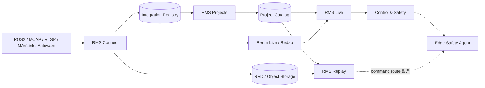

# RMS 서비스 분리 설계

> 상태: Draft v0.1
>
> 기준 흐름: 데이터·Device 연동 → 프로젝트 구성 → Real-time Viewer 또는 Replay Viewer

## 1. 결정

RMS 제품을 사용자 관점에서 다음 네 서비스로 구분한다.

| 제품 서비스 | 내부 이름 | 핵심 책임 |
|---|---|---|
| RMS Connect | `rms-integration-service` | 데이터 Connector, Device 등록, Source/Topic/Frame mapping, 연결 검증 |
| RMS Projects | `rms-project-service` | Project, Device/Data binding, Mission, 권한, Viewer Preset |
| RMS Live | `rms-live-service` | 실시간 Session, Rerun Live data, 상태 동기화, 조건부 제어 |
| RMS Replay | `rms-replay-service` | Recording, Seek, Incident Replay, 주석, 분석과 내보내기 |

사용자는 하나의 RMS 앱과 로그인으로 네 서비스를 이동한다. 내부 책임과 API는 분리하지만 Viewer Engine을 두 벌로 복제하지 않는다.

```text
rms-viewer-core
├── RMS Live   = Rerun Viewer + Live Following + Data Quality + Control capability
└── RMS Replay = Rerun Viewer + Seek/Range + Incident/Annotation - Control capability
```

Replay는 단순히 제어 버튼을 숨기는 수준이 아니다. Replay Service에는 Control API client, 장비 command credential과 Edge command route를 주입하지 않는다.
RMS Live는 현재 Head를 `Following`하는 운용에 집중한다. Live에서 Pause나 과거 Seek를 요청하면 rolling Recording을 가리키는 별도 Replay Session을 만들고 Replay route로 이동한다.

## 2. 전체 서비스 흐름



End-to-end 사용자 흐름은 다음과 같다.

1. **연동**: Device와 데이터 Connector를 등록하고 실제 데이터가 정상인지 검증한다.
2. **프로젝트 구성**: 연동된 Device와 필요한 Data Source를 Project에 연결한다.
3. **작업 시작**: Project에서 Mission/Operation과 Viewer Preset을 선택한다.
4. **실시간 운용**: 온라인 Device는 RMS Live에서 관제하고, 정책이 허용하면 제어한다.
5. **기록 검토**: 완성된 Recording이나 Incident는 RMS Replay에서 탐색하고 분석한다.

## 3. 서비스별 Source of Truth

| 데이터 | Source of Truth | 비고 |
|---|---|---|
| Device identity/capability | RMS Connect | 조직 소유이며 Project에 직접 내장하지 않음 |
| Connector/Data Source/Mapping | RMS Connect | Topic→Entity, schema, frame과 clock policy 포함 |
| Project/Mission/Resource binding | RMS Projects | Device/Data를 ID로 참조하며 payload를 복제하지 않음 |
| Live observation | Rerun Live Runtime | Arrow Chunk, EntityDB, Query와 Transform |
| Live Session/quality | RMS Live | active device/source, viewer preset, freshness와 receiver health |
| Lease/Command/Safety | Control DB + Edge | Viewer나 RRD가 원본이 아님 |
| Recording bytes | RRD Object Storage | 표준 RRD+LZ4와 Footer Manifest 유지 |
| Recording/Incident metadata | RMS Replay Catalog | Project snapshot과 mapping/config version 보존 |
| 감사 원본 | Append-only Audit Store | Rerun Timeline에는 조회용 mirror만 기록 |

## 4. 핵심 데이터 모델

### 4.1 연동 모델

```text
Integration
  id / organization_id / connector_type / endpoint_ref
  credential_ref / status / last_health_at

Device
  id / organization_id / name / kind / capability_set
  safety_profile_id / certificate_id / state_version

EdgeSession
  id / device_id / boot_epoch / connected_at / software_version

DataSource
  id / integration_id / device_id / protocol / source_schema
  live_endpoint / recording_policy / status

MappingProfile
  id / data_source_id / version
  topic_to_entity / timestamp_policy / frame_policy / qos_policy
```

### 4.2 프로젝트 모델

`Device.projectId`처럼 장비 안에 Project를 직접 저장하지 않는다. 기간과 권한을 가진 binding으로 연결한다.

```text
Project
  id / organization_id / name / status / policy_set

DeviceAssignment
  project_id / device_id / valid_from / valid_to
  access_mode = control | observe

DataAssignment
  project_id / data_source_id / valid_from / valid_to
  visibility / recording_policy_override

Mission / Operation
  id / project_id / device_ids / time_range / status

ViewerPresetBinding
  project_id / device_kind / role / preset_id / version
```

규칙:

- 한 Device는 한 시점에 하나의 `control` Project만 가질 수 있다.
- 동일 Device/Data Source를 다른 Project에 `observe` 용도로 공유할 수 있지만 명시적 권한이 필요하다.
- Project에서 binding을 해제해도 Device와 원본 데이터는 삭제하지 않는다.
- Device가 다른 Project로 이동해도 과거 Recording의 Project snapshot은 변경하지 않는다.

### 4.3 Live와 Replay 모델

```text
LiveSession
  id / project_id / operation_id / device_id / data_source_id
  edge_session_id / viewer_preset_version / opened_by
  play_state / source_health / data_quality / started_at

Recording
  id / organization_id / project_snapshot_id / operation_id
  device_id / data_source_id / mapping_version
  rrd_uri / manifest_hash / time_range / quality / retention_state

ReplaySession
  id / recording_ids / incident_id / opened_by
  viewer_preset_version / cursor / selected_entities

IncidentManifest
  incident_id / participant_devices / recording_segment_refs
  clock_mapping / uncertainty / map_tf_config_versions
  data_gaps / command_audit_refs / retention / legal_hold
```

Recording은 `Finalizing` 단계에서 Footer와 checksum을 검증한 후에만 `Ready`가 된다.

## 5. RMS Connect

### 5.1 책임

- ROS 2, MCAP, RTSP, MAVLink/PX4, Autoware와 Custom SDK 연결
- Device identity, certificate, capability와 Edge Session 관리
- Topic/schema 검색과 Rerun Entity/Archetype mapping
- Timestamp, coordinate frame, QoS와 drop policy 검증
- Live Chunk와 RRD Recording Sink에 같은 Observation 전달
- Commissioning Session에서 실제 Project 배정 전 연결 시험

### 5.2 화면

```text
연동
├── 데이터 연결
│   └── Connector 종류 / 연결 상태 / 마지막 수신
├── 장비
│   └── 장비명 / 종류 / 인증 / 상태
└── 매핑 검증
    └── 위치 / 카메라 / 상태 / 진단 준비 여부
```

기본 화면에는 endpoint secret, raw schema, QoS 값과 certificate 내용을 표시하지 않는다. Engineer가 `기술 세부정보`를 열 때만 공개한다.

### 5.3 API 초안

```text
GET/POST  /api/v1/integrations
GET/PATCH /api/v1/integrations/{integration_id}
POST      /api/v1/integrations/{integration_id}/test

GET/POST  /api/v1/devices
GET/PATCH /api/v1/devices/{device_id}
POST      /api/v1/devices/{device_id}/commission

GET/POST  /api/v1/data-sources
GET/PATCH /api/v1/data-sources/{source_id}
GET       /api/v1/data-sources/{source_id}/schema
POST      /api/v1/data-sources/{source_id}/mapping-validations
POST      /api/v1/mapping-profiles/{profile_id}/publish
```

### 5.4 완료 조건

- 연결 성공만으로 Control capability가 활성화되지 않는다.
- unsupported message, TF cycle, clock jump와 인증 실패를 Project 배정 전에 검출한다.
- Live와 Recording이 동일 mapping version을 사용한다.
- 네트워크 단절 중 Edge spool과 재연결 cursor를 제공한다.

## 6. RMS Projects

### 6.1 책임

- 조직과 Project 생성·보관
- 연동된 Device와 Data Source의 기간 기반 binding
- Mission/Operation, 역할, 권한과 보존 정책
- 장비 종류/역할별 Viewer Preset 선택
- Live와 Replay 진입에 필요한 권한이 적용된 Session Context 발급

Project Service는 Sensor payload나 RRD를 JSON으로 복제하지 않는다. Resource ID와 policy만 관리한다.

### 6.2 화면

```text
프로젝트
├── 프로젝트 목록
│   └── 이름 / 운용 상태 / 온라인 장비 수 / 최근 기록
└── 프로젝트 상세
    ├── 장비
    ├── 데이터
    ├── Mission / Operation
    ├── Viewer Preset
    └── 권한 / 보존 정책
```

Project 상세의 기본 행동은 `실시간 열기`와 `기록 보기` 두 가지다. Device ID, Source URI와 내부 mapping version은 기본 화면에서 숨긴다.

### 6.3 API 초안

```text
GET/POST  /api/v1/projects
GET/PATCH /api/v1/projects/{project_id}

GET/POST  /api/v1/projects/{project_id}/device-assignments
DELETE    /api/v1/projects/{project_id}/device-assignments/{assignment_id}
GET/POST  /api/v1/projects/{project_id}/data-assignments
DELETE    /api/v1/projects/{project_id}/data-assignments/{assignment_id}

GET/POST  /api/v1/projects/{project_id}/operations
GET/PATCH /api/v1/operations/{operation_id}
PUT       /api/v1/projects/{project_id}/viewer-presets/{device_kind}
GET       /api/v1/projects/{project_id}/workspace?device_id=
POST      /api/v1/projects/{project_id}/viewer-contexts
```

`workspace` 응답은 Project, Device Assignment, Data Assignment, Source, Topic mapping, Preset과 resource version을 일관된 snapshot으로 반환한다. 여러 목록 API를 순차 조합해 서로 다른 시점의 상태가 섞이지 않게 한다.

### 6.4 Binding 규칙

- Device control assignment 충돌은 저장 단계에서 거부한다.
- Data Source를 공유해도 사용자 권한보다 넓은 Source URL을 발급하지 않는다.
- 활성 Live Session과 연결된 Assignment 해제는 거부하고, Live 종료로 Lease와 Recording을 먼저 정리한다.
- Project 이동 전후 Recording은 각각 당시 Project, mapping과 policy snapshot을 유지한다.
- 과거 Project 권한이 없는 사용자는 Recording object URI를 직접 받을 수 없다.
- Device를 다른 Project로 이동할 때는 활성 Operation과 Lease를 종료하고 기존 Live Session/Recording을 finalize한 후 새 Assignment와 Live Session을 연다.
- 이동 이후 늦게 도착한 Chunk도 현재 Project가 아니라 원래 `live_session_id`의 Recording으로 보낸다.
- 다른 Project에 과거 Recording을 제공할 때 원본을 이동하거나 복제하지 않고 기간·권한이 있는 read-only Data Grant를 발급한다.

## 7. RMS Live

### 7.1 책임

- Project가 발급한 Live Viewer Context 검증
- Rerun Live/Redap/gRPC receiver와 Viewer 연결
- `Following`, receiver health, data completeness와 clock quality 관리
- Device/Topic/Lease/Command 상태 Event 동기화
- Live 중 동시 RRD 기록 상태 표시
- Control & Safety module 호출
- `지난 시점 보기` 요청 시 Lease를 폐기하고 rolling Replay Session으로 전환

### 7.2 Viewer 화면

항상 표시하는 정보는 다음으로 제한한다.

```text
Project / Device / ● LIVE / 종합 상태 / 현재 작업 / 제어권
3D·Map·Camera 중심 Viewer
가장 중요한 경고 1개
현재 허용된 주 행동 1개
```

Rerun README, Entity tree, Blueprint 편집기, raw Topic path와 protocol ACK는 Operator Preset에서 숨긴다.

### 7.3 API 초안

```text
POST   /api/v1/live-sessions
GET    /api/v1/live-sessions/{session_id}
DELETE /api/v1/live-sessions/{session_id}
GET    /api/v1/live-sessions/{session_id}/events
GET    /rerun/live/{session_id}

POST   /api/v1/live-sessions/{session_id}/control-leases
DELETE /api/v1/control-leases/{lease_id}
POST   /api/v1/live-sessions/{session_id}/commands
GET    /api/v1/commands/{command_id}
```

모든 Control endpoint는 Session의 Project, Device, Data Source, 실제 Rerun `Following`, data quality, Device state version, Lease와 Edge 상태를 다시 검증한다.

### 7.4 실패 처리

- Project Service 장애: 기존 Session은 짧은 policy snapshot 동안 관제를 유지하되 새로운 Lease/명령은 fail closed한다.
- Live receiver 장애: Viewer를 `데이터 지연/연결 끊김`으로 전환하고 Control을 차단한다.
- 네트워크 복구: snapshot→resource-version event 순으로 복원하며 Lease를 자동 복구하지 않는다.
- Browser 종료: Edge deadman 정책이 hold/stop/RTL 등 장비별 안전 동작을 수행한다.
- Pause/Seek 요청: Control queue를 fence하고 Lease를 취소한 뒤 Replay Session을 열며 Live Context를 Replay에 재사용하지 않는다.

## 8. RMS Replay

### 8.1 책임

- Project와 권한으로 Recording 검색
- RRD Footer/Manifest 기반 lazy read와 cursor prefetch
- 단일/다중 장비 Incident Replay
- Timeline, annotation, 비교, segment와 export
- Missing Chunk와 clock uncertainty 표시
- 원본 Recording, legal hold와 retention 보호

### 8.2 Viewer 화면

```text
Project / Device / REPLAY / Recording 이름·시각
Timeline / 사건 목록 / 3D·Map·Camera
LIVE로 이동 또는 다른 기록 열기
```

Control 영역은 disabled 상태로 남겨 설명하지 않고 화면에서 제거한다. `REPLAY`와 cursor는 상단과 Timeline에서 항상 식별할 수 있게 한다.

### 8.3 API 초안

```text
GET    /api/v1/projects/{project_id}/recordings
GET    /api/v1/recordings/{recording_id}
POST   /api/v1/replay-sessions
GET    /api/v1/replay-sessions/{session_id}
DELETE /api/v1/replay-sessions/{session_id}
GET    /rerun/replay/{session_id}

GET/POST /api/v1/incidents
GET/PATCH /api/v1/incidents/{incident_id}
POST      /api/v1/incidents/{incident_id}/exports
POST      /api/v1/replay-sessions/{session_id}/annotations
```

Replay Service에는 `/commands`, `/control-leases` endpoint가 존재하지 않는다. Replay access token도 Control audience로 사용할 수 없어야 한다.

### 8.4 실패 처리

- Integration/Device offline: 이미 Ready인 Recording은 계속 조회할 수 있다.
- Footer/Chunk 누락: 전체를 현재 값처럼 보이지 않고 영향 범위를 `일부 데이터 없음`으로 표시한다.
- Object Storage 지연: cursor 주변 요청을 우선하고 background prefetch를 줄인다.
- 권한이 없는 Incident 참여 장비: URI를 노출하지 않고 `제한된 데이터`로 표시한다.

## 9. Live와 Replay 강제 분리

| 항목 | RMS Live | RMS Replay |
|---|---|---|
| 데이터 | 계속 증가하는 Chunk | 변경하지 않는 Recording/Segment |
| 시간 | `Following` 전용, 과거 이동은 Replay로 전환 | Paused/Playing/Seek/Range |
| 상태 Event | resource-versioned SSE/WebSocket | Recording metadata/annotation event |
| Cache | latest state, short history, visible View | cursor 주변, range, incident prefetch |
| Control | 조건 충족 시 capability 주입 | capability와 endpoint 자체 없음 |
| 자격증명 | Live observation + 제한된 control audience | Recording read audience only |
| 장애 기본값 | Control 차단, Edge safe action | 분석 계속 또는 부분 데이터 표시 |
| 주 사용자 | Operator/Supervisor | Operator/Analyst/Engineer |

공유하는 것은 Rerun Entity/Component 모델, Renderer, View/Visualizer, Blueprint 형식과 공통 UI component다. Session state와 API capability는 공유하지 않는다.

### 9.1 Replay 제어 금지의 방어 계층

1. `rms_replay_viewer`는 Control client crate를 링크하지 않는다.
2. Replay access token은 `rms-replay` read audience만 가지며 Live/Control endpoint에서 거부한다.
3. 분리 배포 시 Replay network에서 Edge control port로 가는 route를 차단한다.
4. 과거 Command Entity는 시각화 데이터이며 실행 가능한 Command Envelope로 역직렬화하지 않는다.
5. Replay→Live 이동은 새 Live Session을 만들고 이전 Lease나 command를 복원하지 않는다.
6. Simulator dry-run은 별도 audience와 endpoint를 사용하며 실장비 Edge로 라우팅하지 않는다.

## 10. 하나의 제품 내 화면 구조

```text
RMS
├── 연동                    /integrations
│   ├── 데이터 연결         /integrations/data
│   ├── 장비                /integrations/devices
│   └── 매핑 검증           /integrations/mappings
├── 프로젝트                /projects
│   └── 프로젝트 상세       /projects/:projectId
├── 실시간                  /projects/:projectId/live/:deviceId
└── 기록                    /projects/:projectId/replay/:recordingId
    └── Incident            /incidents/:incidentId/replay
```

권한이 없는 메뉴는 disabled로 나열하지 않고 숨긴다. 각 화면의 주 행동은 원칙적으로 하나만 강조한다.

## 11. 서비스 이벤트

```text
integration.registered
device.registered
device.state.changed
data-source.registered
data-source.state.changed
mapping-profile.published

project.created
project.resource.bound
project.resource.unbound
operation.state.changed
viewer-preset.published

live-session.started
live-session.quality.changed
control.lease.changed
command.state.changed
recording.state.changed

replay-session.started
incident.created
incident.manifest.updated
annotation.created
export.state.changed
```

Event는 `event_id`, `resource_version`, `occurred_at`, `organization_id`, `project_id`, `trace_id`를 공통으로 가진다. Replay 화면에 Live Topic value event를 적용하지 않는다.
Video, PointCloud, 매 frame pose와 같은 payload는 Event bus에 싣지 않고 Redap/RRD data lane을 사용한다. Event bus는 metadata와 lifecycle에만 사용한다.

## 12. 장애 격리 목표

| 장애 | 유지해야 하는 기능 | 차단할 기능 |
|---|---|---|
| Connect/Catalog 장애 | 이미 열린 Replay, Edge local recording | 새 장비 연동, 새 Session 생성 |
| Project Service 장애 | 짧은 시간 기존 Live 관제, 열린 Replay | 권한 변경, 신규 Control Lease/명령 |
| Live Service 장애 | Edge local recording과 local safety | 원격 제어 |
| Replay Service 장애 | Live 관제와 Edge recording | 과거 조회/분석 |
| Object Storage 장애 | Live 관제와 Edge spool | 신규 Replay 또는 누락 구간 조회 |
| Audit 장애 | 정책상 허용된 관제 | 감사 필수 command는 fail closed |

## 13. 현재 코드에서의 이관

### 13.1 Domain 변경

[domain.ts](../../apps/rms-viewer-web/src/domain.ts)의 `Device.projectId`와 `DataSource.projectId` 직접 소유를 다음 구조로 변경했다.

```text
Device.organizationId
DataSource.deviceId + integrationId
Project
DeviceAssignment
DataAssignment
```

입력 `DataSource`와 불변 `Recording`도 분리했다.

- Integration `DataSource`: 실제 입력 연결
- Replay `Recording`: Data Source에서 생성된 불변 기록
- Viewer `ViewerSourceRef`: LiveSession 또는 ReplaySession을 가리키는 tagged reference

### 13.2 Viewer Runtime 변경

현재 `rms_product_app`은 하나의 `re_viewer::App` 안에서 Live와 Replay capability를 타입으로 분리한다.

```text
RmsProductApp
  re_viewer::App / shared panels / preset registry
  ActiveViewerContext::Live(LiveSessionContext + ControlEventSink)
  ActiveViewerContext::Replay(ReplaySessionContext without ControlEventSink)
```

현재 Web Host는 URL route에 따라 Live 또는 Replay Context adapter만 생성한다.
iframe과 `@rerun-io/web-viewer`는 사용하지 않는다.

### 13.3 권장 저장소 구조

```text
crates/rms_domain
crates/rms_integration
crates/rms_project
crates/rms_live_session
crates/rms_replay_session
crates/rms_control
crates/rms_audit
crates/viewer/rms_viewer_core
crates/viewer/rms_live_viewer
crates/viewer/rms_replay_viewer

apps/rms-web
apps/rms-server
apps/rms-edge-agent
```

## 14. 배포 전략

서비스 경계는 처음부터 API와 Domain으로 강제하되, 초기에는 운영 복잡도를 줄이기 위해 다음 세 배포 단위를 권장한다.

```text
rms-app-native / rms-app-web
rms-server      # Connect, Projects, Live, Replay의 modular monolith
rms-edge-agent
```

이후 부하와 장애 격리가 필요해지면 API 계약을 유지한 채 다음 순서로 분리한다.

1. Live ingress/receiver worker
2. Replay query/prefetch worker
3. Recording finalizer와 export worker
4. Integration connector별 worker

네 서비스를 처음부터 네 저장소와 네 Database로 나누지는 않는다. Transaction이 필요한 Project binding과 Session 생성이 분산되고 운영 부담만 증가할 수 있다.

## 15. 구현 순서

### Phase A — Domain과 화면 경계

- `Device.projectId` 제거와 Assignment 모델 추가
- Connect/Projects/Live/Replay route와 권한 경계
- `ViewerSourceRef = LiveSession | ReplaySession`
- Replay Context에서 Control capability 미주입 테스트

### Phase B — Connect와 Projects

- 실제 Catalog DB와 REST API
- 동적 Project/Device/Data 목록
- Commissioning과 mapping validation
- Viewer Preset binding

### Phase C — Viewer 분리

- 공유 `rms_viewer_core` 추출
- `rms_live_viewer`의 Following/quality/SSE
- `rms_replay_viewer`의 Recording/Seek/Incident
- Live Pause/Seek의 ephemeral Replay Session 전환과 새 Live Session 복귀
- 샘플 README와 raw Topic path를 Operator Preset에서 제거

### Phase D — 실제 데이터

- ROS 2/MCAP monitor-only adapter
- Redap Live와 RRD 동시 기록
- Recording finalizer, Object Storage와 Manifest
- disconnect spool, resume cursor와 gap marker

### Phase E — 안전 제어와 운영

- Control DB, Lease/fencing, Edge Safety Agent와 Audit
- Simulator/SIL 후 제한된 capability만 Live에 공개
- PX4 SITL, Autoware Simulator, HIL
- HA, retention, legal hold와 인증서 rotation

## 16. 1차 완료 기준

- Device와 Data Source를 Project에 중복 복사하지 않고 binding할 수 있다.
- Project에서 온라인 Device는 RMS Live, Recording은 RMS Replay로 정확히 열린다.
- Live와 Replay가 같은 Rerun View를 공유해도 Session/credential/API capability는 섞이지 않는다.
- Replay-originated command dispatch가 API 우회 테스트를 포함해 0건이다.
- Device Project 이동 후 과거 Recording의 Project snapshot과 권한이 변하지 않는다.
- Operator 화면에는 Project, Device, LIVE/REPLAY, health, task와 필요한 행동만 표시된다.
- Integration 장애 중에도 Ready Recording Replay가 가능하고, Replay 장애 중에도 Live/Edge recording이 유지된다.
