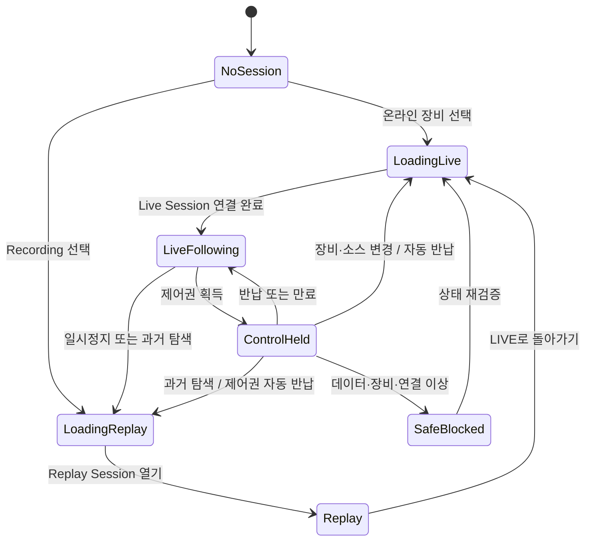

# RMS 통합 시스템 시나리오

> 상태: Draft v0.1
>
> 기준 구현: Rerun `0.36.1` + `rms_product_app`
>
> 목적: 제품 개발, 화면 설계, API 설계와 테스트가 같은 시나리오 ID를 사용하도록 하는 기준 문서

서비스 책임과 API 경계는 [RMS 서비스 분리 설계](./RMS_SERVICE_ARCHITECTURE.md)를 따른다. 사용자 여정은 `RMS Connect → RMS Projects → RMS Live 또는 RMS Replay` 순서로 구성한다.

## 1. 시나리오 원칙

RMS는 프로젝트·장비·데이터·Viewer·제어를 하나의 제품 화면으로 제공한다. 사용자는 Rerun 내부 구조를 알 필요가 없으며, 현재 작업을 판단하는 데 필요한 정보만 본다.

모든 시나리오는 다음 불변조건을 따른다.

1. Rerun `TimeControl`이 화면의 Live·Pause·Replay 시간을 결정한다.
2. 프로젝트, 장비, Mission, 데이터 소스와 사용자 권한은 RMS Session Context가 결합한다.
3. Replay, Pause, 불완전한 데이터, 장비 이상 상태에서는 제어가 실패 안전 방식으로 차단된다.
4. Viewer가 명령을 직접 장비에 보내지 않는다. RMS Control API와 Edge Safety Agent가 다시 검증한다.
5. 장비·데이터 소스·재생 상태가 바뀌면 기존 제어권을 자동 반납한다.
6. 명령의 `요청`, `승인`, `전달`, `수락`, `실행`, `완료`, `거부`를 서로 다른 상태로 기록한다.
7. 정상 화면에는 설명 문단, Entity 경로, Chunk 정보, 프로토콜 코드를 상시 표시하지 않는다.
8. 기술 정보는 Engineer 권한의 진단 화면에서 요청한 경우에만 공개한다.

## 2. 사용자와 시스템 구성요소

| 구분 | 역할 |
|---|---|
| Operator | 한 장비의 Live 관제, Replay, 허용된 Mission 제어 |
| Supervisor | 다중 장비 관제, 제어권 인계, 고위험 명령 승인, Incident 관리 |
| Engineer | Topic, TF, QoS, Chunk, GPU와 Adapter 진단 |
| Administrator | 프로젝트, 사용자, 장비, 인증서, Preset과 보존 정책 관리 |
| RMS Product App | Native/Web 통합 화면과 Session Context 소유 |
| Rerun Runtime | EntityDB, ChunkStore, Query, Transform, Timeline, Blueprint와 렌더링 |
| RMS API | Project·Device·Source·Topic Catalog, 권한, Lease, Command, Audit 제공 |
| Edge Safety Agent | 장비 상태 재검증, 명령 전달, Deadman/Failsafe와 최종 거부 권한 소유 |

## 3. 공통 Session Context

화면과 API는 다음 값을 하나의 원자적 Context로 취급한다.

```text
organization / project / mission
device / edge-session / device-state-version
data-source / recording / source-kind
viewer-preset / active-recording / timeline / play-state
operator / role / control-lease
data-quality / device-health / active-command / incident
```

일부 값만 이전 Context에서 재사용하지 않는다. 예를 들어 장비가 바뀌었는데 이전 장비의 Lease나 Topic 값이 새 장비 화면에 붙어서는 안 된다.

## 4. 운용 상태 모델



`ControlHeld`는 `LiveFollowing`에서만 존재할 수 있다. `Replay`에서 명령 실행 경로로 이동하는 전이는 없으며, Live와 Replay는 서로 다른 Session Context와 capability를 사용한다.

## 5. 시나리오 요약

상태 표기:

- `로컬 검증됨`: `rms_server`, 제품 Runtime, 자동 테스트와 브라우저에서 확인
- `부분 구현`: 로컬 Vertical Slice는 있으나 실제 장비, Edge 또는 영속 저장소 연결이 없음
- `계획`: 상세 설계만 존재

| ID | 시나리오 | 우선순위 | 현재 상태 |
|---|---|---:|---|
| SCN-001 | 프로젝트·장비 Session 시작 | P0 | 로컬 검증됨 |
| SCN-002 | 로봇 Live 관제 | P0 | 로컬 검증됨 |
| SCN-003 | Topic 기반 Viewer Preset 전환 | P0 | 로컬 검증됨 |
| SCN-004 | Live 일시정지·과거 탐색·복귀 | P0 | 부분 구현 |
| SCN-005 | Recording 저장과 Incident Replay | P0 | 로컬 검증됨 |
| SCN-006 | 제어권 획득과 반납 | P0 | 로컬 검증됨 |
| SCN-007 | Mission 명령과 안전 정지 | P0 | 로컬 검증됨 |
| SCN-008 | 장비·데이터 변경 중 비동기 제어 응답 | P0 | Client 검증됨 |
| SCN-009 | 데이터 지연·유실·연결 단절 | P0 | 부분 구현 |
| SCN-010 | 다중 장비 Incident 대응 | P1 | 계획 |
| SCN-011 | 장비 등록과 Adapter 검증 | P1 | 계획 |
| SCN-012 | 감사·보존·사후 분석 | P1 | 계획 |
| SCN-013 | Web 메모리·GPU 저하 모드 | P1 | 계획 |
| SCN-014 | Emergency Stop과 복구 잠금 | P0 | 계획 |

## 6. 상세 시나리오

### SCN-001 — 프로젝트·장비 Session 시작

**사용자 목표**

Operator가 로그인 후 자신에게 허용된 프로젝트와 장비를 열고 즉시 운용 상태를 파악한다.

**사전조건**

- 사용자가 OIDC 인증을 완료했다.
- 사용자에게 프로젝트 읽기 권한이 있다.
- RMS API에 Device와 Data Source가 등록되어 있다.

**기본 흐름**

1. 앱이 `/projects`에서 허용된 프로젝트만 가져온다.
2. 마지막 사용 프로젝트가 유효하면 복원하고, 아니면 첫 프로젝트를 선택한다.
3. 프로젝트의 장비를 상태 순으로 가져온다.
4. Operator가 장비를 선택한다. 온라인 장비는 Live를, 오프라인 장비는 최근 정상 Recording을 우선 제안한다.
5. 앱이 장비의 Live와 Recording, Topic mapping을 하나의 Viewer Context로 만든다.
6. Rerun Runtime이 선택한 `source_url`을 열고 준비 완료를 알린다.
7. 화면은 프로젝트명, 장비명, `LIVE/REPLAY`, 종합 상태, 배터리와 현재 작업만 표시한다.

**예외 흐름**

- 권한 없음: 해당 프로젝트와 장비를 목록에 표시하지 않는다.
- 사용 가능한 장비 없음: `사용 가능한 장비가 없습니다.`와 프로젝트 변경만 제공한다.
- Viewer 준비 실패: `화면을 불러오지 못했습니다.`와 재시도만 제공한다.

**Acceptance 기준**

- 사용자는 5초 안에 장비, Live/Replay와 장비 상태를 식별한다.
- 이전 Session의 Topic, Lease와 명령 상태가 새 장비에 남지 않는다.
- Operator 화면에 내부 ID와 프로토콜 오류가 나타나지 않는다.

**현재 구현 차이**

- 실제 HTTP Catalog와 Context 전달을 구현했고 Rust Runtime은 Host가 주입한 임의 장비 ID를 수용한다.
- 장비와 데이터는 tenant resource로 등록하고 Project Assignment로 연결한다.
- 인증은 운영 OIDC가 아닌 현재 Host transport 경계만 존재한다.

### SCN-002 — 로봇 Live 관제

**사용자 목표**

Operator가 Robot Operations Preset에서 위치, 카메라, 작업과 핵심 상태를 실시간으로 본다.

**사전조건**

- 선택된 Source가 `Live`다.
- Rerun receiver가 장비의 Observation Chunk를 받고 있다.
- 필수 Transform과 Clock 상태가 유효하다.

**기본 흐름**

1. ROS 2 Adapter가 Timestamp와 Frame을 정규화해 Rerun Chunk를 생성한다.
2. Live Server와 RRD Recording Sink에 같은 Chunk를 전달한다.
3. Rerun EntityDB와 Query Engine이 최신 상태를 갱신한다.
4. Robot Operations Preset이 3D/Map, 전방 Camera, Task와 상태만 렌더링한다.
5. Timeline은 Head를 따라가며 상단에 `● LIVE`를 표시한다.
6. RMS는 데이터 freshness, 장비 health와 Viewer readiness를 제어 가능성 계산에 반영한다.

**화면 정보 예산**

- 항상 표시: 장비, LIVE, health, battery, task, 가장 중요한 경고 1개.
- 필요할 때 표시: 경로, 속도, 제어권과 명령 상태.
- 기본 숨김: README, Entity tree, Blueprint 편집기, raw Topic path, Query/Chunk 상세.

**Acceptance 기준**

- 같은 Timestamp의 3D, Camera와 상태가 동기화된다.
- Viewer가 준비되기 전에는 제어가 활성화되지 않는다.
- 정상 운용 중 설명 문단이나 샘플 README View가 표시되지 않는다.

**현재 구현 차이**

- Rerun 3D/Camera와 제품 Panel의 단일 Canvas 통합은 검증됐다.
- 로컬 Live는 저장소의 22KB RRD fixture와 SSE telemetry를 사용하므로 실제로 증가하는 Redap Stream은 아니다.
- 로컬 fixture의 기술 Blueprint를 Operator Preset에서 숨겨 샘플 README와 raw Topic path가 화면에 나타나지 않는다.

### SCN-003 — Topic 기반 Viewer Preset 전환

**사용자 목표**

Foxglove와 유사하게 Topic 성격과 작업 목적에 맞는 화면을 선택하되 직접 복잡한 Layout을 만들지 않는다.

**기본 흐름**

1. RMS API가 Topic의 label, Entity path, renderer class와 quality를 반환한다.
2. Operator가 `운영`, `카메라`, `진단` 중 하나를 선택한다.
3. RMS가 프로젝트·장비 종류·Preset에 대응하는 immutable Blueprint를 활성화한다.
4. Rerun View와 Visualizer가 해당 Entity만 Query하고 렌더링한다.
5. 개인 Camera/Zoom overlay는 저장할 수 있지만 조직 표준 상태·제어 영역은 고정한다.

**Preset 예시**

| Preset | 기본 공개 정보 |
|---|---|
| Robot Operations | 3D/Map, 전방 Camera, Task, battery |
| Drone Flight | Map, FPV, altitude, battery, flight state |
| Autonomous Vehicle | Map/3D, Camera, route, operation mode |
| Inspection | 선택된 Camera, checklist, capture 상태 |
| Incident Replay | Timeline, event, Camera/3D 동기화 |
| Engineering Diagnostics | Topic/TF/QoS/Chunk/GPU 상세 |

**Acceptance 기준**

- Preset 전환은 Recording과 Timeline cursor를 바꾸지 않는다.
- Operator Preset에는 raw path와 기술 설명이 노출되지 않는다.
- 데이터가 없는 View는 빈 Panel을 남기지 않고 숨긴다.

**현재 구현 차이**

- Topic의 renderer class에 따른 제품 Panel 필터와 데이터 소스별 Live 선택은 구현되어 있다.
- 서버 Preset 저장, Blueprint 생성기와 Topic-to-Entity mapping은 후속 구현이다.
- 제품 Panel은 raw Topic path를 숨기고 label과 현재 값만 표시한다.

### SCN-004 — Live 일시정지·과거 탐색·복귀

**사용자 목표**

Operator가 Live 화면을 잠시 멈춰 과거를 확인하고 안전하게 현재 시점으로 돌아온다.

**기본 흐름**

1. Operator가 `지난 시점 보기` 또는 `일시정지`를 누른다.
2. RMS Live는 Control queue를 fence하고 보유 Lease를 즉시 사용 불가 상태로 만든 뒤 서버에 반납한다.
3. RMS Replay가 rolling Recording의 현재 시점을 가리키는 ephemeral Replay Session을 생성한다.
4. 앱이 Replay route로 이동하고 Rerun `TimeControl`을 Paused 상태로 연다.
5. 화면은 `REPLAY · LIVE에서 N초 전`으로 바뀌며 Control capability와 UI가 존재하지 않는다.
6. Operator가 Timeline을 탐색해 Camera, 3D와 상태를 같은 cursor에서 본다.
7. `LIVE로 이동`을 누르면 새 Live Session을 만들고 최신 Head를 다시 확인한다.
8. 실제 PlayState가 `Following`이고 데이터와 장비가 정상일 때 `● LIVE`로 전환한다.
9. 제어는 자동 복구하지 않으며 사용자가 다시 Lease를 요청한다.

**Acceptance 기준**

- UI의 Live label과 Rerun 실제 PlayState가 다르면 제어는 차단된다.
- Replay 전환과 동시에 Control transport, 버튼과 확인창이 폐기된다.
- Live 복귀만으로 이전 Lease가 복원되지 않는다.

**현재 구현 차이**

- Rerun 실제 PlayState와 `Following/Pause` 명령 연결, Lease 자동 반납은 구현되어 있다.
- Live의 과거 보기와 Replay의 LIVE 열기는 별도 Session과 route 전환 이벤트로 분리되어 있다.
- 실제 growing stream의 reconnect, latency와 live-head gap 표시는 후속 구현이다.

### SCN-005 — Recording 저장과 Incident Replay

**사용자 목표**

Operator가 사고 전후의 다중 센서와 명령 이력을 같은 Timeline에서 재생한다.

**기본 흐름**

1. Ingress가 Live 전달과 동시에 표준 RRD로 기록한다.
2. Catalog가 Project, Mission, Device, 시작/종료 시각, 보존 등급과 RRD 위치를 저장한다.
3. 경고 또는 명령 실패가 발생하면 Incident가 관련 시간 범위를 북마크한다.
4. 사용자가 Incident를 열면 `REPLAY` 상태와 Incident Replay Preset을 적용한다.
5. Lazy loading과 prefetch가 cursor 주변 Chunk를 우선 로드한다.
6. Sensor, Transform, Command, ACK와 Safety Event를 동일 Timeline에서 확인한다.
7. 사용자가 증거 범위를 고정하고 주석 또는 내보내기를 요청한다.

**Acceptance 기준**

- Replay 진입 시 어떤 Control widget도 장비 명령을 전송할 수 없다.
- 누락 Chunk가 있으면 `일부 데이터 없음`을 표시하고 영향받는 분석을 구분한다.
- Incident export가 원본 Recording, 감사 trace와 무결성 검증 값을 포함한다.

**현재 구현 차이**

- `rms_server`가 Live 종료 시 불변 Project snapshot을 가진 Recording을 만들고 별도 ReplaySession으로 연다.
- Live 종료 전에는 Assignment 해제를 거부하며, 종료 시 Lease 폐기와 SSE 종료를 함께 처리한다.
- 현재 Recording과 RRD는 메모리와 로컬 fixture이므로 Footer 검증, Object Storage와 보존 정책은 후속 구현이다.
- 동시 RRD 기록, 운영 Catalog, Incident 자동 연결과 Object Storage는 계획 단계다.

### SCN-006 — 제어권 획득과 반납

**사용자 목표**

한 명의 Operator만 현재 장비를 제어하고, 다른 사용자는 보유자를 명확히 확인한다.

**사전조건**

- Source는 Live이며 Rerun 실제 상태가 `Following`이다.
- Viewer가 준비됐고 데이터와 장비 health가 정상이다.
- 사용자에게 해당 장비의 제어 권한이 있다.

**기본 흐름**

1. 화면은 `현재 보기 전용`과 `제어권 요청` 하나만 표시한다.
2. 요청은 device ID, expected state version와 request ID를 포함한다.
3. 서버가 권한, 기존 보유자, Device version과 Edge Session을 확인한다.
4. Lease가 발급되면 device ID, holder, epoch와 만료 시각을 검증한다.
5. 화면은 `제어권: 나 · 남은 시간`과 `반납`을 표시한다.
6. Operator가 반납하거나 Lease가 만료되면 즉시 제어를 비활성화한다.

**예외 흐름**

- 다른 사용자가 보유: 보유자 이름과 `보기 전용`만 표시한다.
- 만료되거나 다른 장비의 Lease 응답: 저장하지 않고 즉시 반납한다.
- Device version 변경: 상태 새로고침 후 다시 요청하도록 한다.

**Acceptance 기준**

- request ID와 device ID가 일치하지 않는 응답은 현재 Session에 적용되지 않는다.
- 요청·반납 중에는 명령 버튼이 비활성화된다.
- Lease ID, epoch와 fencing token은 Operator 화면에 노출하지 않는다.

**현재 구현 차이**

- 실제 로컬 서버에서 요청 상관관계, 만료, holder, version, 장비 단일 Lease와 반납 흐름을 검증했다.
- 운영 IAM, 서버 fencing과 Edge Lease 검증은 후속 구현이다.

### SCN-007 — Mission 명령과 안전 정지

**사용자 목표**

Operator가 현재 작업을 일시정지하거나 장비를 안전하게 정지시키고 결과를 추적한다.

**기본 흐름**

1. Operator가 `Mission 일시정지` 또는 `안전 정지`를 선택한다.
2. 앱은 대상 장비와 예상 결과를 한 줄로 확인한다.
3. 확인 시점에 Live, PlayState, Source, Viewer readiness, health, version, Lease와 만료를 다시 검증한다.
4. 명령은 idempotency key, request ID, lease epoch, issued/expires time을 포함한다.
5. 서버와 Edge가 최신 상태와 안전 정책을 각각 검증한다.
6. 화면은 `장비로 전달 중` → `장비가 요청을 받음` → `실행 중` → `완료`를 구분한다.
7. 요청과 모든 결과를 감사 원본 및 Rerun Command Timeline에 기록한다.

**Fail-safe 결과**

- 응답 시간 초과는 `완료`가 아니라 `결과 확인 필요`로 표시한다.
- Edge 거부가 Cloud 승인보다 우선한다.
- 중복 요청은 기존 command 결과를 반환하며 두 번 실행하지 않는다.

**Acceptance 기준**

- `Accepted`를 `Succeeded`로 표시하지 않는다.
- 확인창을 열어 둔 사이 Context가 바뀌면 실행을 거부한다.
- 안전 정지는 bulk telemetry backlog와 다른 우선순위 lane을 사용한다.

**현재 구현 차이**

- 로컬 서버의 Mission pause와 safe stop, 확인 직전 재검증, Session 범위 idempotency 계약을 구현했다.
- 같은 idempotency key의 정확한 재시도만 이전 결과를 반환하고 payload가 다르면 충돌로 거부한다.
- 현재 Web bridge는 `commandId`와 수락/실행/완료 상태를 보존하지 않고 요약 문구만 전달하므로 전체 command lifecycle을 연결해야 한다.
- 실제 ROS 2 Action, MAVLink ACK, Autoware API와 Edge Safety Agent는 계획 단계다.

### SCN-008 — 장비·데이터 변경 중 비동기 제어 응답

**사용자 목표**

빠르게 장비나 Replay를 전환해도 이전 요청이 현재 화면과 제어 상태를 오염시키지 않는다.

**기본 흐름**

1. Operator가 Robot-07의 Lease를 요청한다.
2. 응답이 오기 전에 Robot-12 또는 Recording을 선택한다.
3. 앱은 workspace generation을 증가시키고 현재 제어 상태를 즉시 차단한다.
4. 이전 장비의 늦은 Lease 응답이 도착한다.
5. request ID, device ID, Source kind와 현재 Session이 일치하지 않으므로 응답을 적용하지 않는다.
6. 앱은 늦게 발급된 Lease를 서버에 반납한다.

**Acceptance 기준**

- 이전 장비의 Lease가 새 장비 화면에 표시되지 않는다.
- 늦은 release 응답이 더 새로운 Lease를 삭제하지 않는다.
- 장비·Source 변경 후 명령 confirmation은 자동 폐기된다.

**현재 구현 차이**

- Rust 제품 Runtime의 pending request 상관관계와 Web의 Session·device 검증, 이탈 후 Lease 정리로 구현됐다.
- 다중 브라우저·다중 서버 인스턴스 경쟁 조건은 운영 통합 테스트가 필요하다.

### SCN-009 — 데이터 지연·유실·연결 단절

**사용자 목표**

Operator가 기술 오류를 해석하지 않고도 계속 관제 가능한지와 제어 가능 여부를 판단한다.

**기본 흐름**

1. Runtime이 필수 상태의 freshness, missing Chunk, clock quality와 receiver 상태를 계산한다.
2. 내부 품질을 `Complete`, `Partial`, `Stale`, `Unavailable`로 분류한다.
3. Operator 화면에는 각각 `정상`, `일부 데이터 없음`, `데이터 지연`, `연결 끊김`으로 표시한다.
4. 필수 제어 상태가 Partial/Stale/Unavailable이면 Lease와 명령을 차단한다.
5. Edge는 Cloud 연결이 끊겨도 장비별 local safe action을 실행한다.
6. 재연결 시 checkpoint 이후 gap을 표시하고 누락 범위를 복구한다.
7. Live 복구 후에도 제어권은 자동 재발급하지 않는다.

**Acceptance 기준**

- Camera 지연이 제어에 영향을 주는지 정책에 따라 명시적으로 결정된다.
- 연결 복구가 이전 command를 자동 재전송하지 않는다.
- 한 원인의 여러 프로토콜 오류는 Operator에게 하나의 운용 경고로 합쳐진다.

**현재 구현 차이**

- 장비 `online/degraded/offline`과 기본 control gate는 존재한다.
- App이 Live SSE를 구독하고 오류 또는 10초 heartbeat 만료 시 제어권을 반납하며 fail-closed 처리한다.
- 구조화된 completeness, receiver health, 재연결과 gap recovery는 후속 구현이다.

### SCN-010 — 다중 장비 Incident 대응

**사용자 목표**

Supervisor가 Fleet 전체를 감시하다 이상 장비의 Live 또는 사고 기록으로 빠르게 전환한다.

**기본 흐름**

1. Fleet 화면은 장비별 `정상/주의/위험/연결 끊김`과 현재 Mission만 요약한다.
2. 위험 이벤트가 발생하면 가장 높은 우선순위 Incident 하나를 강조한다.
3. Supervisor가 장비를 선택하면 해당 Session Context를 원자적으로 연다.
4. 필요하면 현재 Operator에게 제어권 인계를 요청한다.
5. Live 안전 조치 후 Incident Replay로 전환해 사건 전후를 검토한다.
6. 관련 장비가 여러 대면 원본 RRD를 수정하지 않고 참여 장비, segment/layer, clock uncertainty, map/TF/config version, gap과 audit reference를 담은 `IncidentManifest`로 가상 Session을 합성한다.
7. 공통 wall-clock과 clock quality를 기준으로 장비별 Timeline을 정렬한다.

**Acceptance 기준**

- 한 장비의 Topic, Lease와 경고가 다른 장비에 섞이지 않는다.
- Fleet 요약에는 raw Topic 목록을 표시하지 않는다.
- Incident 전환 시 Live와 Replay 상태를 혼동할 수 없다.

**현재 구현 차이**

- 검증용 장비 전환 UI만 존재한다.
- Fleet event aggregation, 제어권 인계와 다중 Recording 동기화는 계획 단계다.

### SCN-011 — 장비 등록과 Adapter 검증

**사용자 목표**

Administrator가 새 로봇·드론·차량을 안전하게 프로젝트에 연결한다.

**기본 흐름**

1. 프로젝트와 장비 종류를 선택하고 Device identity를 발급한다.
2. Edge 인증서와 최소 권한 정책을 설치한다.
3. ROS 2, MCAP, RTSP, MAVLink 또는 Autoware Adapter Profile을 선택한다.
4. Topic→Entity, Timestamp, Coordinate Frame과 QoS mapping을 검증한다.
5. 테스트 Stream을 격리된 Commissioning Session에 수집한다.
6. Transform, 데이터 품질, Recording 재생과 Preset을 확인한다.
7. Control은 Simulator/SIL을 통과한 capability만 별도로 활성화한다.

**Acceptance 기준**

- 데이터 연결 성공만으로 물리 제어 권한이 활성화되지 않는다.
- 지원하지 않는 message, frame cycle과 clock jump를 활성화 전에 검출한다.
- 인증서 폐기 시 Observation과 Control 연결이 정책대로 종료된다.

**현재 구현 차이**

- Adapter와 Device Registry는 상세 설계만 존재한다.

### SCN-012 — 감사·보존·사후 분석

**사용자 목표**

감사 담당자와 Engineer가 누가 무엇을 보고 어떤 명령을 수행했는지 재구성한다.

**기본 흐름**

1. RMS Audit Store가 인증, Session, Lease, command와 policy 결과를 append-only로 기록한다.
2. 같은 trace ID를 가진 요약 Event를 Rerun Timeline에도 기록한다.
3. Incident 화면에서 Sensor와 Command Event를 함께 조회한다.
4. 원본 Audit와 Rerun mirror의 trace를 대조한다.
5. 권한이 있는 사용자가 서명된 Incident package를 내보낸다.
6. 보존 만료 시 정책에 따라 Recording과 metadata를 삭제하거나 legal hold를 유지한다.

**Acceptance 기준**

- 감사 원본은 Viewer나 Recording 삭제 권한으로 수정할 수 없다.
- 모든 명령은 사용자, 장비, Lease epoch, 정책 버전과 Edge 결과로 추적된다.
- 삭제와 export 자체도 감사 Event로 남는다.

**현재 구현 차이**

- Command UI 상태만 존재하며 운영 Audit Store와 retention workflow는 계획 단계다.
- Rust Runtime request ID, HTTP request ID와 향후 Edge command ID를 하나의 trace로 연결하는 계약도 아직 없다.

### SCN-013 — Web 메모리·GPU 저하 모드

**사용자 목표**

Web 환경의 메모리·GPU 한계에서도 핵심 관제 화면이 종료되지 않고 우선순위가 낮은 데이터를 점진적으로 줄인다.

**기본 흐름**

1. Runtime Policy가 RAM, VRAM, decoder 수와 frame time을 감시한다.
2. 현재 보이는 View와 cursor 주변 Chunk를 가장 높은 우선순위로 유지한다.
3. 숨겨진 Camera decode, 고밀도 PointCloud LOD와 먼 구간 prefetch를 순서대로 줄인다.
4. 저하가 계속되면 `화면 성능을 조정했습니다.`만 표시한다.
5. 필수 상태가 보장되지 않으면 제어를 차단하고 Native Viewer 사용을 안내한다.

**Acceptance 기준**

- 저하 모드가 Command/health 상태보다 Camera나 PointCloud를 먼저 제거한다.
- 사용자가 보지 않는 Camera decoder가 무제한 유지되지 않는다.
- Web capability 부족이 stack trace나 Rerun 내부 오류로 표시되지 않는다.

**현재 구현 차이**

- release Wasm과 기본 Rerun memory policy만 사용한다.
- 통합 RAM/VRAM/decoder budget과 제품 저하 단계는 계획 단계다.

### SCN-014 — Emergency Stop과 복구 잠금

**사용자 목표**

충돌 위험이나 제어기 이상 시 일반 명령 경로 상태와 관계없이 현장 안전 정책에 따라 장비를 정지시키고, 임의 재가동을 막는다.

**중요한 구분**

- 현재 `safe_stop`은 Live, 정상 상태와 Lease를 요구하는 통제 정지 명령이다.
- Emergency Stop은 일반 command queue의 이름만 바꾼 기능이 아니며, 별도 권한·우선 lane·Edge 상태기계와 물리 정지 경로가 필요하다.

**기본 흐름**

1. 권한 있는 사용자가 명확히 분리된 Emergency UI 또는 현장 물리 스위치를 사용한다.
2. RMS가 사용자, 장비, 이유와 현재 Incident를 기록하고 Emergency 우선 lane으로 전달한다.
3. Edge Safety Agent가 일반 Motion Lease와 독립된 정책으로 local stop을 실행한다.
4. 장비는 `EmergencyStop → RecoveryLockout` 상태로 전환한다.
5. 화면은 `비상 정지됨`과 현장 확인이 필요한 다음 행동만 표시한다.
6. 원인 해소, 제한된 reset 권한, 현장 확인, 새 Lease와 명시적 engage 전에는 운행을 재개하지 않는다.

**Fail-safe 결과**

- Cloud 또는 Viewer가 끊겨도 현장 물리/Edge 정지가 우선한다.
- telemetry backlog와 일반 command queue가 Emergency 전달을 막지 않는다.
- ACK가 없으면 `정지 완료`로 단정하지 않고 `현장 확인 필요`를 표시한다.

**Acceptance 기준**

- 통신 지연·packet loss·Gateway 장애 주입 중에도 장비별 stop deadline을 충족한다.
- Emergency 전의 Lease와 미완료 명령이 자동 재사용되지 않는다.
- 정지와 reset의 모든 단계가 불변 감사 기록에 남는다.
- HIL과 현장 안전 책임자 승인 전에는 실장비 UI에 기능을 노출하지 않는다.

**현재 구현 차이**

- 실제 Emergency lane, Recovery Lockout, Edge/물리 정지와 감사는 구현되어 있지 않다.
- 현재 Mock `safe_stop`을 Emergency Stop으로 간주해서는 안 된다.

## 7. 도메인별 대표 변형

### ROBOT-01 — ROS 2 이동 로봇 목적지 이동

1. Robot Operations Preset에서 3D/Map 목표를 선택한다.
2. RMS가 Map frame, localization freshness와 safety zone을 검증한다.
3. 예상 경로, 거리와 중요 제한을 한 줄로 표시한다.
4. 확인 후 ROS 2 Action goal로 전달한다.
5. feedback과 cancel/preemption을 Command Timeline에 기록한다.
6. localization stale, obstacle 또는 Edge 거부 시 이동을 시작하지 않는다.

### DRONE-01 — PX4 드론 이륙과 RTL

1. Drone Flight Preset에서 GPS, battery, geofence와 flight mode를 확인한다.
2. 이륙은 고위험 명령으로 hold-to-confirm 또는 Supervisor 승인을 요구한다.
3. Edge Agent가 MAVLink command/ACK와 Offboard proof-of-life를 담당한다.
4. Cloud는 목표 고도와 같은 intent만 보낸다.
5. link loss 또는 geofence 위반 시 PX4/Edge의 RTL·Land 정책이 우선한다.

### VEHICLE-01 — Autoware Route와 Operation Mode

1. Autonomous Vehicle Preset에서 route와 perception 상태를 확인한다.
2. RMS가 Autoware의 mode change 가능 상태를 조회한다.
3. Route 설정 후 예상 경로와 제한을 확인한다.
4. Autonomous/Local/Remote mode 전환은 policy와 승인 절차를 거친다.
5. RMS는 `vehicle_cmd_gate`를 우회하지 않는다.

### INSPECTION-01 — 다중 Camera 점검

1. Inspection Preset이 현재 checklist에 필요한 Camera만 decode한다.
2. Operator가 장비 또는 Camera를 선택하면 warm-set을 갱신한다.
3. 사진/구간 캡처 Event를 Recording Timeline에 기록한다.
4. 끊긴 Camera 하나가 전체 Viewer를 중단시키지 않는다.
5. 영상 지연이 원격 조작 안전 한도를 넘으면 관련 제어만 차단한다.

## 8. 시나리오 기반 테스트 매트릭스

| 테스트 ID | 연결 시나리오 | 수준 | 필수 검증 |
|---|---|---|---|
| T-001 | SCN-001 | Browser E2E | Context 로드, 최소 상태 표시, 오류 문구 |
| T-002 | SCN-002/003 | Integration | Topic→Entity→View, Blueprint와 Timeline 유지 |
| T-003 | SCN-004 | Integration | Pause/Seek/Return-live와 Lease 자동 반납 |
| T-004 | SCN-005 | Integration | Live+RRD 동시 기록, lazy replay, missing data 표시 |
| T-005 | SCN-006 | Unit/Integration | 만료·holder·version·epoch·동시 Lease 경쟁 |
| T-006 | SCN-007 | SIL | idempotency, ACK 의미, timeout과 결과 불명 |
| T-007 | SCN-008 | Unit/E2E | 늦은 응답, source/device 전환과 stale release |
| T-008 | SCN-009 | Chaos | latency, packet loss, reconnect, gap, no auto command |
| T-009 | SCN-010 | E2E | 다중 장비 Context 격리와 Incident 전환 |
| T-010 | SCN-011 | Commissioning | TF cycle, clock jump, unsupported schema와 인증서 폐기 |
| T-011 | SCN-012 | Security | 감사 불변성, trace 대조, retention/legal hold |
| T-012 | SCN-013 | Performance | Web memory pressure, decoder/LOD 저하 순서 |
| T-013 | ROBOT-01 | SIL/HIL | ROS 2 Action feedback, cancel, localization loss |
| T-014 | DRONE-01 | SITL/HIL | ACK, retry, offboard loss, geofence, RTL/Land |
| T-015 | VEHICLE-01 | Simulator/HIL | mode transition, route, gate heartbeat와 emergency |
| T-016 | SCN-014 | Chaos/HIL | 우선 lane, local stop, Recovery Lockout과 reset 감사 |

## 9. 개발 순서

1. **현재 Vertical Slice 고정**: SCN-001~004와 SCN-006~008 자동 테스트를 CI에 고정한다.
2. **실제 Observation 연결**: SCN-002, SCN-004, SCN-005를 ROS 2/MCAP live+recording으로 완성한다.
3. **제품 Blueprint**: 현재 숨김 기반 Operator Preset을 서버 관리형 도메인 Blueprint로 확장한다.
4. **Control Foundation**: SCN-006~009를 실제 RMS API와 Edge Safety Agent에 연결한다.
5. **Simulator**: ROBOT-01, DRONE-01, VEHICLE-01을 SIL에서 검증한다.
6. **운영 제품화**: SCN-010~013과 HIL, 보안, 감사, HA 및 보존 정책을 완성한다.

## 10. 시나리오 완료 정의

시나리오는 화면이 보이는 것만으로 완료하지 않는다. 다음 조건을 모두 충족해야 `완료`로 변경한다.

- 정상 흐름과 모든 Fail-safe 흐름이 자동 테스트에 연결됐다.
- Operator 화면의 정보 노출량이 UX 기준을 만족한다.
- 권한, Context, Timeline과 Control gate가 서버와 Edge에서 다시 검증된다.
- 장애 후 자동 재전송, 자동 Lease 복원 또는 Replay-originated command가 없다.
- Audit trace로 입력, 판단, 명령과 결과를 재구성할 수 있다.
- 실제 Adapter 시나리오는 SIL/HIL 검증과 운영 Runbook 승인을 통과했다.
